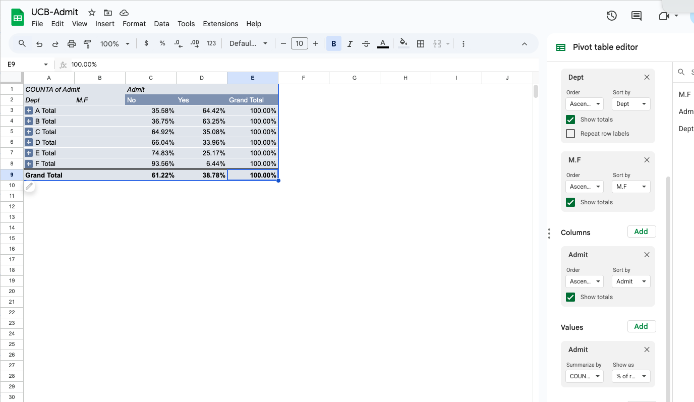

Today, we begin a or perhaps the core topic: probability.

## One key bit of data

- [UCB-Admissions](./data/UCB-Admit.csv).   

# Slides

[Link is here](https://robertwwalker.github.io/BUS1301-SP26/slides/02-10-2026/)

## UCB Admissions

**Is there evidence of sex bias in admission practices?**  Data on admissions to the University of California at Berkeley graduate programs in six departments are presented for the population of applicants.  **Admit** measures whether or not the applicant was admitted; **M.F** measures the gender of the applicant; **Dept** measures the department in a classification ranging from A to F.  

## The class plan:

1. Defining probability.   
2. Pivots and tables.  
3. Visualizing tables.  

Your assignment for this time:

1. Do the reading.
2. The assignment: use Gemini and/or Notebook LM to complete the three excerpts from Jaynes.

## For Next Class:

1. Reading: Chapter 3 if not already and read through Jaynes on Probability.
2. Deliverable: A conversation on probability [Assignment 9].   
