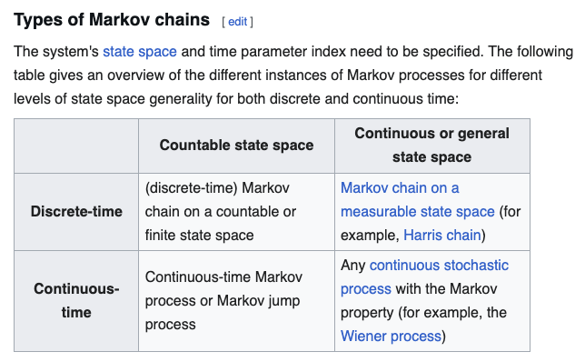

Today, we continue probability.

# Slides

[Link is here](https://robertwwalker.github.io/BUS1301-SP26/slides/02-12-2026/)

<embed src="./img/DRR.pdf" type="application/pdf" width="100%" height="500px">

## uh oh

[link](https://theshamblog.com/an-ai-agent-published-a-hit-piece-on-me/)

## A Crucial Matrix/Table of Probabilities

[A Markov Chain](https://en.wikipedia.org/wiki/Markov_chain)

## Bayes Rule and Tests

The crucial ideas of Type I and Type II errors; sensitivity and specificity.

# The Magic of Bayes Rule

To find the joint probability [the intersection] of x and y, we can use either of the aforementioned methods.  To turn this into a conditional probability, we simply take it is a proportion of the relevant margin.

$$ Pr(x | y) = \frac{Pr(y | x) Pr(x)}{Pr(y)} $$

By itself, this is algebra.  It is magic in an application.

$$ Pr(User | +) = \frac{Pr(+ | User) Pr(User)}{Pr(+)} $$

This poses the question: what does a positive test mean?

## Working an Example

Suppose a test is 99% accurate for Users and 95% accurate for non-Users.  Moreover, suppose that Users make up 10% of the population.  So given some population to which this applies, we have:

$Pr(User, +) = Pr(+ | User)*Pr(User)$

$Pr(User, -) = Pr(- | User)*Pr(User)$

$Pr(\overline{User}, +) = Pr(+ | \overline{User})*Pr(\overline{User})$

and

$Pr(\overline{User}, -) = Pr(- | \overline{User})*Pr(\overline{User})$

### The Table

 Status  |  Positive | Negative | Total
---------|-----------|----------|------
 User    | 0.099     | 0.001    | 0.1
non-User | 0.045     | 0.855    | 0.9
---------|-----------|----------|------
Total    | 0.144     | 0.856    | 1.0

$Pr(User | +) = \frac{Pr(+ | User) Pr(User)}{Pr(+)}$

yields:

$Pr(User | +) = \frac{0.099 [0.99*0.1]}{0.144[0.99*0.1 + 0.05*0.9]} = 0.6875$

## One key bit of data

- [UCB-Admissions](./data/UCB-Admit.csv).   

## UCB Admissions

**Is there evidence of sex bias in admission practices?**  Data on admissions to the University of California at Berkeley graduate programs in six departments are presented for the population of applicants.  **Admit** measures whether or not the applicant was admitted; **M.F** measures the gender of the applicant; **Dept** measures the department in a classification ranging from A to F.  

## The class plan:

1. Defining probability.   
2. Pivots and tables.  
3. Visualizing tables.  

Your assignment for this time:

1. Do the reading.
2. The assignment: use Gemini and/or Notebook LM to complete the three excerpts from Jaynes.

## For Next Class:

1. Reading: Chapter 3 if not already and read through Jaynes on Probability.
2. Deliverable: A quiz on probability [Assignment 10].   
