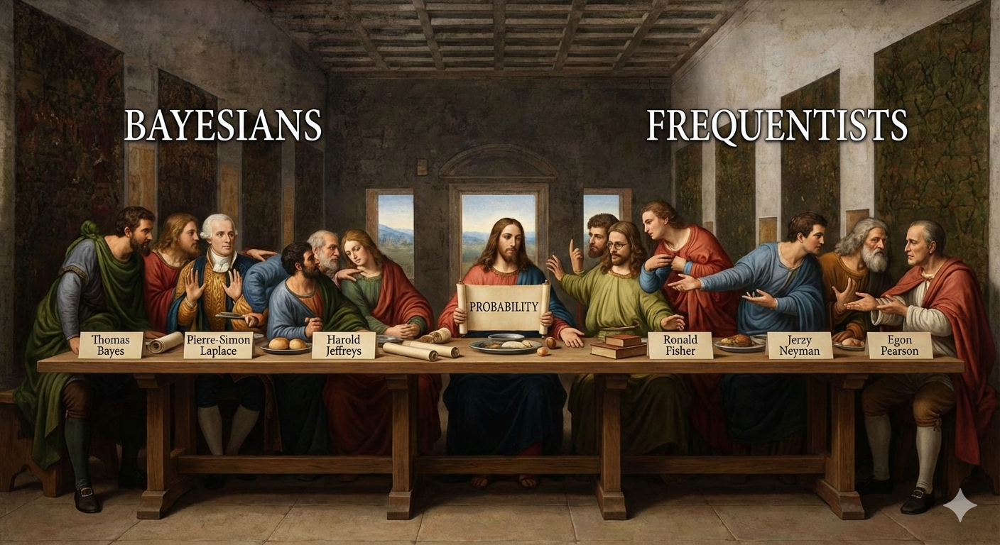
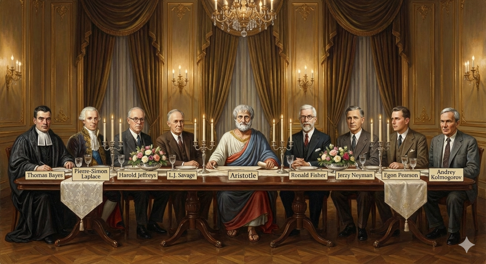
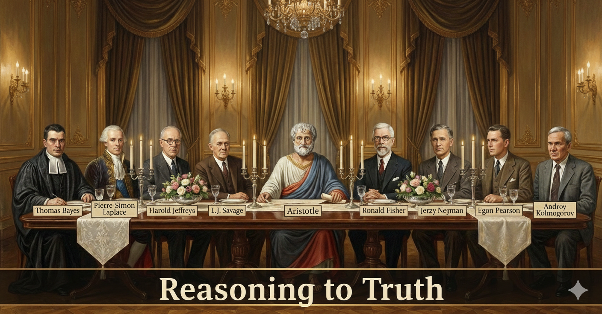

Today, we explore probability distributions.

## LLMs are Built on Probability Distributions

The next token prediction conditional on the current and prior tokens is exactly what large language models do.

More of a banquet...

## One key bit of data

- [UCB-Admissions](./data/UCB-Admit.csv).   

# An App?

[App](https://robertwwalker.github.io/GeminiStatsDist/)

# Slides

[Link is here](https://robertwwalker.github.io/BUS1301-SP26/slides/02-17-2026/)

## The class plan:

1. Defining probability.   
2. Pivots and tables.  
3. Visualizing tables.  

Your assignment for this time:

1. Do the reading.
2. The assignment: use Gemini and/or Notebook LM to complete the three excerpts from Jaynes.

## For Next Class:

1. Reading: Chapter 3 if not already and read through Jaynes on Probability.
2. Deliverable: A conversation on probability [Assignment 9].   
