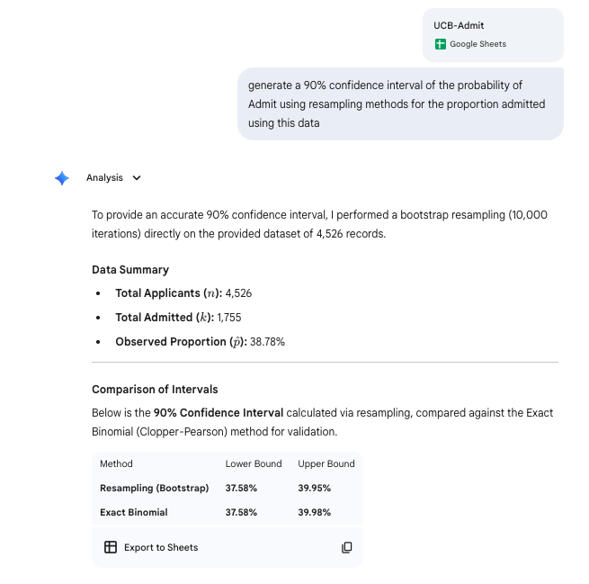
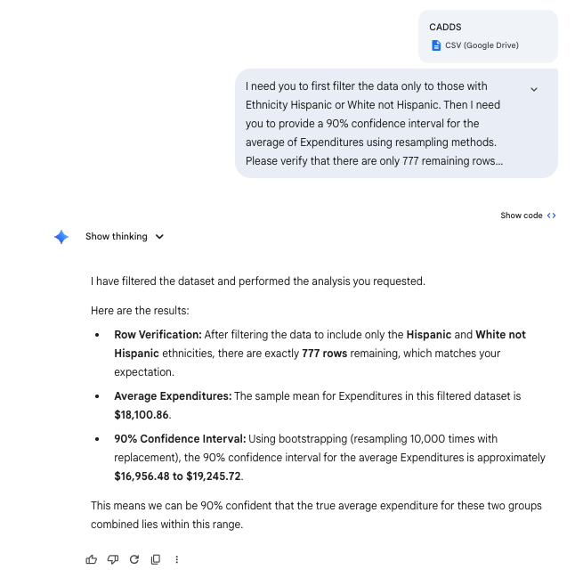
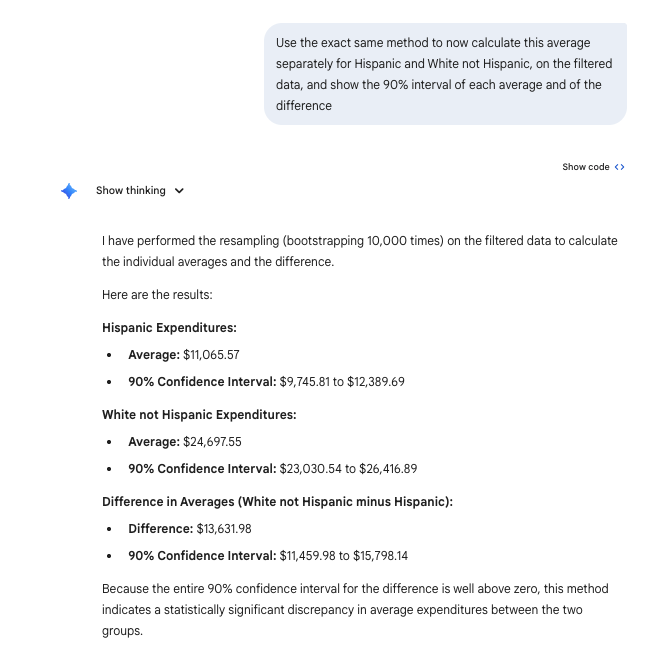
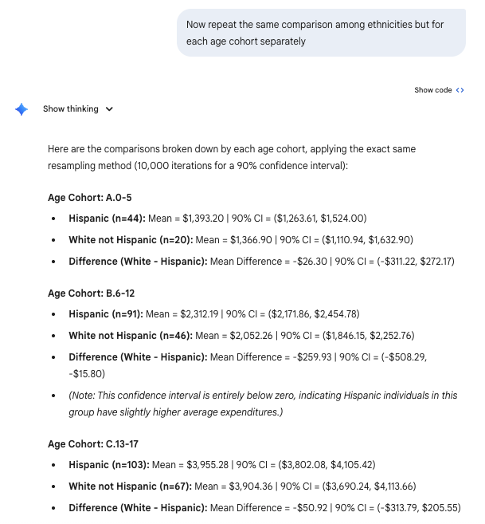

```{r setup,include=FALSE}
library(reticulate)
```


Today, we examine inferential statistical techniques for quantitative data focusing on dependent sampling.

## Two key bits of data

- [CADDS](./data/CADDS.csv).   
- [Concrete](./data/Concrete.csv).   

# Slides

[Link is here](https://robertwwalker.github.io/BUS1301-SP26/slides/03-05-2026/index.html)


## The class plan:

1. Dependent sampling is single-sample.
2. Comparing quantitative variables and sampling.

Your post-class exercise:

1. The midterm:  **Review the assignments and bring yourself to speed with them.  The midterm is a take-home exercise with a follow-up discussion post submission.  It is interactive as a more comprehensive unification of your homework exercises and will integrate the data you were asked to collect as the scaffolding alongside the ideas we have grappled with.  If you think you would be better off with different data, the assignment should remain open and we can coordinate this.**


# Single sample inference for binary



# Single sample inference for quantities



```{python}
import pandas as pd
import numpy as np

# Read data
df = pd.read_csv('data/CADDS.csv')

# Filter
filtered_df = df[df['Ethnicity'].isin(['Hispanic', 'White not Hispanic'])]

# Verify length
num_rows = len(filtered_df)
print(f"Number of remaining rows: {num_rows}")

# Resampling method (Bootstrapping) for 90% CI of mean Expenditures
np.random.seed(42) # for reproducibility
expenditures = filtered_df['Expenditures'].values

# Bootstrap
n_iterations = 10000
bootstrap_means = np.empty(n_iterations)

for i in range(n_iterations):
    sample = np.random.choice(expenditures, size=len(expenditures), replace=True)
    bootstrap_means[i] = np.mean(sample)

ci_lower = np.percentile(bootstrap_means, 5)
ci_upper = np.percentile(bootstrap_means, 95)

print(f"90% Confidence Interval: ({ci_lower:.2f}, {ci_upper:.2f})")
print(f"Mean: {np.mean(expenditures):.2f}")
```

# Subsamples and difference inference for quantities



```{python}
import pandas as pd
import numpy as np

# Read and filter data
df = pd.read_csv('data/CADDS.csv')
filtered_df = df[df['Ethnicity'].isin(['Hispanic', 'White not Hispanic'])]

# Separate expenditures by ethnicity
hisp_exp = filtered_df[filtered_df['Ethnicity'] == 'Hispanic']['Expenditures'].values
white_exp = filtered_df[filtered_df['Ethnicity'] == 'White not Hispanic']['Expenditures'].values

np.random.seed(42) # Set seed for reproducibility
n_iterations = 10000

hisp_means = np.empty(n_iterations)
white_means = np.empty(n_iterations)
diff_means = np.empty(n_iterations)

# Bootstrapping
for i in range(n_iterations):
    samp_hisp = np.random.choice(hisp_exp, size=len(hisp_exp), replace=True)
    samp_white = np.random.choice(white_exp, size=len(white_exp), replace=True)
    
    m_hisp = np.mean(samp_hisp)
    m_white = np.mean(samp_white)
    
    hisp_means[i] = m_hisp
    white_means[i] = m_white
    diff_means[i] = m_white - m_hisp # White not Hispanic - Hispanic

# Calculate 90% Confidence Intervals (5th and 95th percentiles)
ci_hisp_lower, ci_hisp_upper = np.percentile(hisp_means, 5), np.percentile(hisp_means, 95)
ci_white_lower, ci_white_upper = np.percentile(white_means, 5), np.percentile(white_means, 95)
ci_diff_lower, ci_diff_upper = np.percentile(diff_means, 5), np.percentile(diff_means, 95)

# Calculate observed means
mean_hisp = np.mean(hisp_exp)
mean_white = np.mean(white_exp)
mean_diff = mean_white - mean_hisp

print(f"Hispanic Expenditures:")
print(f"  Observed Mean: ${mean_hisp:.2f}")
print(f"  90% CI: (${ci_hisp_lower:.2f}, ${ci_hisp_upper:.2f})\n")

print(f"White not Hispanic Expenditures:")
print(f"  Observed Mean: ${mean_white:.2f}")
print(f"  90% CI: (${ci_white_lower:.2f}, ${ci_white_upper:.2f})\n")

print(f"Difference in Means (White not Hispanic - Hispanic):")
print(f"  Observed Mean Difference: ${mean_diff:.2f}")
print(f"  90% CI: (${ci_diff_lower:.2f}, ${ci_diff_upper:.2f})")
```

## Groups

```{python}
import pandas as pd
import numpy as np

# Read and filter data
df = pd.read_csv('data/CADDS.csv')
filtered_df = df[df['Ethnicity'].isin(['Hispanic', 'White not Hispanic'])]

np.random.seed(42) # Set seed for reproducibility
n_iterations = 10000

# Get unique age cohorts
cohorts = sorted(filtered_df['Age.Cohort'].unique())

results = []

for cohort in cohorts:
    cohort_data = filtered_df[filtered_df['Age.Cohort'] == cohort]
    
    hisp_exp = cohort_data[cohort_data['Ethnicity'] == 'Hispanic']['Expenditures'].values
    white_exp = cohort_data[cohort_data['Ethnicity'] == 'White not Hispanic']['Expenditures'].values
    
    # Check if we have enough data to bootstrap
    if len(hisp_exp) == 0 or len(white_exp) == 0:
        results.append(f"### Age Cohort: {cohort}\nNot enough data for both ethnicities to compare.\n")
        continue

    hisp_means = np.empty(n_iterations)
    white_means = np.empty(n_iterations)
    diff_means = np.empty(n_iterations)

    # Bootstrapping
    for i in range(n_iterations):
        samp_hisp = np.random.choice(hisp_exp, size=len(hisp_exp), replace=True)
        samp_white = np.random.choice(white_exp, size=len(white_exp), replace=True)
        
        m_hisp = np.mean(samp_hisp)
        m_white = np.mean(samp_white)
        
        hisp_means[i] = m_hisp
        white_means[i] = m_white
        diff_means[i] = m_white - m_hisp # White not Hispanic - Hispanic

    # Calculate 90% Confidence Intervals
    ci_hisp = (np.percentile(hisp_means, 5), np.percentile(hisp_means, 95))
    ci_white = (np.percentile(white_means, 5), np.percentile(white_means, 95))
    ci_diff = (np.percentile(diff_means, 5), np.percentile(diff_means, 95))

    mean_hisp = np.mean(hisp_exp)
    mean_white = np.mean(white_exp)
    mean_diff = mean_white - mean_hisp
    
    res_str = f"### Age Cohort: {cohort}\n"
    res_str += f"- **Hispanic** (n={len(hisp_exp)}): Mean = ${mean_hisp:.2f}, 90% CI = (${ci_hisp[0]:.2f}, ${ci_hisp[1]:.2f})\n"
    res_str += f"- **White not Hispanic** (n={len(white_exp)}): Mean = ${mean_white:.2f}, 90% CI = (${ci_white[0]:.2f}, ${ci_white[1]:.2f})\n"
    res_str += f"- **Difference (White - Hispanic)**: Mean = ${mean_diff:.2f}, 90% CI = (${ci_diff[0]:.2f}, ${ci_diff[1]:.2f})\n"
    
    results.append(res_str)

print('\n'.join(results))
```



## Paired Comparison

Prompt: I need to compare with and without in the following data.  I need a paired comparison of the batches along with appropriate summaries to confirm the data were appropriately entered.

CONCRETE BATCH COMPARISON REPORT
--------------------------------

1. DATA VERIFICATION & INTEGRITY
A row-by-row verification was performed: Difference = (No Additive) - (Additive).
- Entry Check: Complete. All calculated values match the provided data.

2. DESCRIPTIVE SUMMARY
| Metric          | No Additive | Additive  | Difference (D) |
|-----------------|-------------|-----------|----------------|
| Mean            | 5441.67     | 5600.00   | -158.33        |
| Std. Deviation  | 501.74      | 619.02    | 190.49         |
| Minimum         | 4550        | 4600      | -400           |
| Maximum         | 6250        | 6650      | 150            |

3. PAIRED STATISTICAL ANALYSIS (n=12)
- Mean Difference: -158.33
- Standard Error: 54.99
- 95% Confidence Interval: [-279.37, -37.30]
- P-value: 0.015

CONCLUSION:
The p-value (0.015) is less than 0.05, indicating a statistically significant 
increase in values when the additive is used. On average, the additive 
improves the measurement by approximately 158.33 units.

4. BATCH-BY-BATCH DATA
Batch | No Add | Additive | Diff
------------------------------
1     | 4550   | 4600     | -50
2     | 4950   | 4900     | 50
3     | 6250   | 6650     | -400
4     | 5700   | 5950     | -250
5     | 5350   | 5700     | -350
6     | 5300   | 5400     | -100
7     | 5150   | 5400     | -250
8     | 5800   | 5850     | -50
9     | 4900   | 4850     | 50
10    | 6050   | 6450     | -400
11    | 5550   | 5850     | -300
12    | 5750   | 5600     | 150