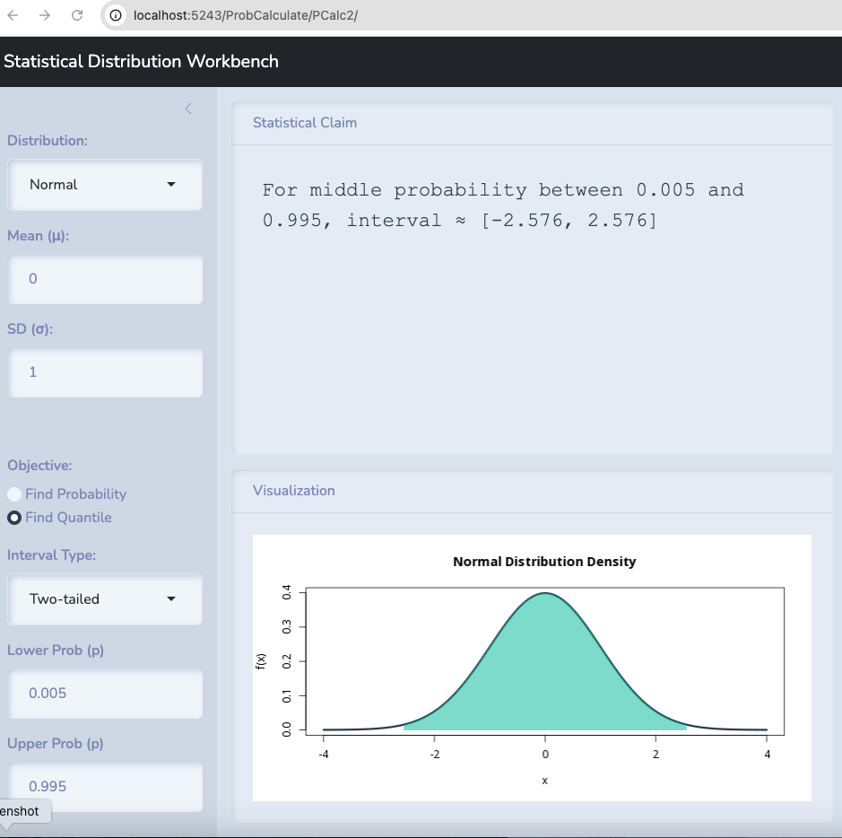

```{r setup,include=FALSE}
library(reticulate)
```


Today, we will spend extensive time revisiting the logic of hypothesis testing and apply it to relationships among two variables along with a backward looking exploration of existing tests.

## Two key bits of data

- [CADDS](./data/CADDS.csv).   
- [Berkeley](./data/UCB-Admit.csv).   

:::{.callout-warning}
## Hypotheses must be complete

With binary data, all we have is $\pi$ or $\hat{p}$.  Whichever we have, we use.
:::


# Slides

[Link is here](https://robertwwalker.github.io/BUS1301-SP26/slides/03-10-2026/index.html)


## The class plan:

1. Squares, correlation and regression
2. a Claude app


Your post-class exercise:

1. The midterm.  
2. Use an LLM and the suggested materials to grapple with Pearl's argument.

# Hypothesis Testing

```{r}
Concrete <- read.csv("data/Concrete.csv")
Concrete
mean(Concrete$Diff)
sd(Concrete$Diff)
sd(Concrete$Diff)/sqrt(12)
(mean(Concrete$Diff) - 0)/(sd(Concrete$Diff)/sqrt(12))
```


# On Causality

Causation is at the heart of the highest order human reasoning.  Doing so with data is an objective if not an end result of modern fascination with machine learning.  Yet, these are age old philosophical questions and modern work at the intersection of data and causation is perhaps best exemplified in the work of Judea Pearl.  His most recent work, The Book of Why, details a lifetime of investigating causes and causal models at the intersection of computing, philosophy, and statistics.  Though wide ranging, [his podcast with Lex Fridman is worth listening to](https://share.google/FqVPW7tanZqALa2NM).  The excerpt on [correlation and causation is very useful.](https://www.youtube.com/watch?v=oFy2927b8jQ)

He develops a ladder of causation.  [This is quite well explained in this two page primer](https://web.cs.ucla.edu/~kaoru/3-layer-causal-hierarchy.pdf).

1. Associational

2. Interventional

3. Counterfactual

We want to understand precisely how these various levels influence what we learn from data and deploy data to accomplish.

[Judea Pearl’s website](https://bayes.cs.ucla.edu/home.htm)

The [book on statistics and causal inference](https://web.cs.ucla.edu/~kaoru/primer-complete-2019.pdf)

[A lecture on the Book of Why](https://youtu.be/nWaM6XmQEmU?si=nAtQu51kIfjoboBi)

Sections 2.1 to 2.10 of the Causal Mixtape are a [very succinct read](https://mixtape.scunning.com/02-probability_and_regression).


## Illustrating an Hypothesis Test with the Normal

Let's take the example of Berkeley.  Let's test the hypothesis that $\pi=0.5$ first and let's examine it with 99% confidence.

I will use the class tool to find that percentage.



Anything within 2.576 standard deviations above or below the mean is possible with 99% confidence.

The standard error in this case is 

$$\sqrt{\frac{\pi(1-\pi)}{n}}$$

This gives us $0.5 \pm z*$ `r sqrt(0.5*0.5/4526)`.

Or $0.5 \pm 0.019$.

Anything between 0.481 and 0.519 could be observed if 0.5 is true.

## A Single Tail

Let's take the example of Berkeley.  Let's test the hypothesis that $\pi \leq 0.5$ against the alternative that it is bigger and let's examine it with 99% confidence.

I will use the class tool to find that percentage.


Anything within 2.236 standard deviations above the mean is possible with 99% confidence.

The standard error in this case is 

$$\sqrt{\frac{\pi(1-\pi)}{n}}$$

This gives us $0.5 - z*$ `r sqrt(0.5*0.5/4526)`.

Or $0.5 + 2.236*0.019$.

Anything below 0.5166 could be observed if 0.5 or less is true.

## Overview

This document illustrates how **ordinary least squares (OLS) regression** applies
to cost accounting. We simulate 52 weeks of production data, estimate a cost
function, and explore the regression output interactively.

The data-generating process (DGP) is:

$$\text{Cost}_t = \underbrace{16{,}750}_{\text{fixed overhead}} + \underbrace{150}_{\beta_1} \times \text{Units}_t + \underbrace{\varepsilon_t}_{\text{error}}$$

where $\varepsilon_t \sim \mathcal{N}(16{,}750,\; 4{,}000^2)$ and $\text{Units}_t$
follows a Poisson distribution with arrival rate $\lambda = 2{,}000$ truncated
below at $1{,}500$.

::: {.callout-note}
## Intercept interpretation
The error term has a non-zero mean of \$16,750, so the **effective DGP intercept**
is $16{,}750 + 16{,}750 = \$33{,}500$. The OLS estimator targets this combined
value. Managers should distinguish the *accounting* fixed cost (\$16,750) from the
*statistical* intercept estimated by regression.
:::

---

## Parameters

| Parameter | Symbol | Value |
|:---|:---:|---:|
| Poisson arrival rate | $\lambda$ | 2,000 units |
| Truncation lower bound | --- | 1,500 units |
| Variable cost per unit | $\beta_1$ | \$150 |
| Fixed overhead | $\beta_0^{\text{acct}}$ | \$16,750 |
| Error mean | $\mu_\varepsilon$ | \$16,750 |
| Error std dev | $\sigma_\varepsilon$ | \$4,000 |
| Effective DGP intercept | $\beta_0^{\text{DGP}}$ | \$33,500 |
| Sample size | $n$ | 52 weeks |

: Simulation parameters {.striped .hover}

---

## Interactive explorer

The widget below generates a fresh 52-week sample and provides four analytical
views. Use the **New sample** button to resample and observe how estimates vary.

```{=html}
<style>
#rce-wrap * { box-sizing: border-box; }
.rce-tabs { display: flex; gap: 8px; flex-wrap: wrap; margin-bottom: 1.25rem; }
.rce-btn { background: transparent; border: 1px solid #bbb; padding: 6px 14px;
  font-size: 13px; cursor: pointer; color: #555; border-radius: 8px; font-family: inherit; }
.rce-btn.active { background: #e2e8f0; color: #111; font-weight: 600; border-color: #888; }
.rce-metrics { display: grid; grid-template-columns: repeat(4, minmax(0,1fr));
  gap: 10px; margin-bottom: 1.25rem; }
.rce-card { background: #f1f5f9; border-radius: 8px; padding: 12px 16px; }
.rce-card-label { font-size: 12px; color: #64748b; margin: 0 0 4px; }
.rce-card-val { font-size: 20px; font-weight: 600; margin: 0; color: #1e293b; }
.rce-panel { display: none; }
.rce-panel.active { display: block; }
.rce-chart-wrap { width: 100%; margin-bottom: 0.5rem; }
.rce-controls { display: flex; gap: 12px; align-items: center;
  margin-bottom: 12px; flex-wrap: wrap; font-size: 13px; color: #555; }
.rce-controls select { border: 1px solid #ccc; border-radius: 6px;
  padding: 4px 8px; font-size: 13px; }
.rce-pred-box { background: #f1f5f9; border-radius: 10px;
  padding: 1.25rem; margin-bottom: 1rem; }
.rce-pred-grid { display: grid; grid-template-columns: repeat(3, minmax(0,1fr));
  gap: 10px; margin-top: 16px; }
.rce-decomp { margin-top: 16px; padding: 12px; background: #fff;
  border-radius: 8px; border: 1px solid #e2e8f0; font-size: 13px; }
.rce-decomp p { margin: 0; color: #1e293b; }
.rce-note { font-size: 12px; color: #64748b; margin-top: 8px; }
.rce-sub-grid { display: grid; grid-template-columns: repeat(3, minmax(0,1fr));
  gap: 10px; margin-top: 12px; }
@media (max-width: 600px) {
  .rce-metrics { grid-template-columns: repeat(2, 1fr); }
  .rce-pred-grid { grid-template-columns: repeat(2, 1fr); }
}
</style>

<div id="rce-wrap">
  <div class="rce-metrics">
    <div class="rce-card"><p class="rce-card-label">Observations</p>
      <p class="rce-card-val" id="rce-m-n">52</p></div>
    <div class="rce-card"><p class="rce-card-label">R&sup2;</p>
      <p class="rce-card-val" id="rce-m-r2">&#8212;</p></div>
    <div class="rce-card"><p class="rce-card-label">Slope (&beta;&#x2081;)</p>
      <p class="rce-card-val" id="rce-m-slope">&#8212;</p></div>
    <div class="rce-card"><p class="rce-card-label">Intercept (&beta;&#x2080;)</p>
      <p class="rce-card-val" id="rce-m-int">&#8212;</p></div>
  </div>

  <div class="rce-tabs">
    <button class="rce-btn active" onclick="rceTab('scatter',this)">Scatter plot</button>
    <button class="rce-btn" onclick="rceTab('residuals',this)">Residuals</button>
    <button class="rce-btn" onclick="rceTab('dist',this)">Distributions</button>
    <button class="rce-btn" onclick="rceTab('predict',this)">Prediction tool</button>
    <button class="rce-btn" onclick="rceResample()">&#8635; New sample</button>
  </div>

  <div id="rce-panel-scatter" class="rce-panel active">
    <div class="rce-controls">
      <span>Show:</span>
      <label><input type="checkbox" id="rce-chk-ols" checked onchange="rceDrawScatter()"> OLS fit</label>
      <label><input type="checkbox" id="rce-chk-true" onchange="rceDrawScatter()"> True DGP</label>
      <label><input type="checkbox" id="rce-chk-ci" onchange="rceDrawScatter()"> 95% CI band</label>
    </div>
    <div class="rce-chart-wrap"><canvas id="rce-c-scatter" height="340"></canvas></div>
  </div>

  <div id="rce-panel-residuals" class="rce-panel">
    <div class="rce-controls">
      <span>X-axis:</span>
      <select id="rce-res-xaxis" onchange="rceDrawResid()">
        <option value="fitted">Fitted values</option>
        <option value="units">Units</option>
        <option value="week">Week</option>
      </select>
    </div>
    <div class="rce-chart-wrap"><canvas id="rce-c-resid" height="320"></canvas></div>
    <div class="rce-sub-grid">
      <div class="rce-card"><p class="rce-card-label">Residual mean</p>
        <p class="rce-card-val" id="rce-r-mean">&#8212;</p></div>
      <div class="rce-card"><p class="rce-card-label">Residual std dev</p>
        <p class="rce-card-val" id="rce-r-std">&#8212;</p></div>
      <div class="rce-card"><p class="rce-card-label">RMSE</p>
        <p class="rce-card-val" id="rce-r-rmse">&#8212;</p></div>
    </div>
  </div>

  <div id="rce-panel-dist" class="rce-panel">
    <div class="rce-tabs" style="margin-bottom:12px;">
      <button class="rce-btn active" id="rce-dt-units" onclick="rceDrawDist('units')">Units</button>
      <button class="rce-btn" id="rce-dt-costs" onclick="rceDrawDist('costs')">Total costs</button>
      <button class="rce-btn" id="rce-dt-errors" onclick="rceDrawDist('errors')">Residuals</button>
    </div>
    <div class="rce-chart-wrap"><canvas id="rce-c-dist" height="300"></canvas></div>
    <p class="rce-note" id="rce-dist-note"></p>
  </div>

  <div id="rce-panel-predict" class="rce-panel">
    <div class="rce-pred-box">
      <p style="font-size:13px;color:#64748b;margin:0 0 12px;">
        Drag slider to set production volume and read off cost forecast.</p>
      <div class="rce-controls">
        <label>Units:</label>
        <input type="range" min="1500" max="2700" value="2000" id="rce-pred-slider"
               oninput="rcePred()" style="flex:1;min-width:120px;">
        <span style="font-size:14px;font-weight:600;min-width:52px;color:#1e293b;"
              id="rce-pred-uout">2,000</span>
      </div>
      <div class="rce-pred-grid">
        <div class="rce-card"><p class="rce-card-label">OLS prediction</p>
          <p class="rce-card-val" id="rce-pred-ols">&#8212;</p></div>
        <div class="rce-card"><p class="rce-card-label">95% PI lower</p>
          <p class="rce-card-val" id="rce-pred-lo">&#8212;</p></div>
        <div class="rce-card"><p class="rce-card-label">95% PI upper</p>
          <p class="rce-card-val" id="rce-pred-hi">&#8212;</p></div>
      </div>
      <div class="rce-decomp">
        <p style="font-size:12px;color:#64748b;margin:0 0 4px;">Decomposition</p>
        <p id="rce-pred-decomp">&#8212;</p>
      </div>
    </div>
    <div class="rce-chart-wrap"><canvas id="rce-c-predict" height="300"></canvas></div>
  </div>
</div>

<script>
(function () {
  "use strict";
  var D = [], FIT, CUR_DIST = 'units', CUR_TAB = 'scatter';

  // --- Random number generation ---
  // For Poisson(lambda=2000), use Normal approx: N(2000, sqrt(2000)).
  // P(X < 1500) < 10^-28, so truncation at 1500 is essentially never triggered.
  function rng_normal(mu, sigma) {
    var u, v;
    do { u = Math.random(); } while (u === 0);
    do { v = Math.random(); } while (v === 0);
    return mu + sigma * Math.sqrt(-2.0 * Math.log(u)) * Math.cos(2.0 * Math.PI * v);
  }
  function rng_trunc_poisson(lam, lo) {
    // Normal approximation valid for large lambda (lambda=2000 here).
    var v;
    do { v = Math.round(rng_normal(lam, Math.sqrt(lam))); } while (v < lo);
    return v;
  }

  function generate() {
    D = [];
    for (var w = 1; w <= 52; w++) {
      var u = rng_trunc_poisson(2000, 1500);
      var e = rng_normal(16750, 4000);
      D.push({ week: w, units: u, error: e, cost: 16750 + u * 150 + e });
    }
  }

  // --- OLS ---
  function ols() {
    var n = D.length;
    var xs = D.map(function (d) { return d.units; });
    var ys = D.map(function (d) { return d.cost; });
    var mx = xs.reduce(function (a, b) { return a + b; }, 0) / n;
    var my = ys.reduce(function (a, b) { return a + b; }, 0) / n;
    var ss = 0, sp = 0, i;
    for (i = 0; i < n; i++) {
      ss += (xs[i] - mx) * (xs[i] - mx);
      sp += (xs[i] - mx) * (ys[i] - my);
    }
    var b1 = sp / ss, b0 = my - b1 * mx;
    var fitted = xs.map(function (x) { return b0 + b1 * x; });
    var resids = ys.map(function (y, i) { return y - fitted[i]; });
    var sst = ys.reduce(function (a, y) { return a + (y - my) * (y - my); }, 0);
    var sse = resids.reduce(function (a, r) { return a + r * r; }, 0);
    return { b0: b0, b1: b1, fitted: fitted, resids: resids,
             r2: 1 - sse / sst, se2: sse / (n - 2), n: n, mx: mx, ss: ss };
  }

  function fmt(n) { return n.toLocaleString(); }
  function set(id, v) { document.getElementById(id).textContent = v; }

  function updateCards() {
    FIT = ols();
    set('rce-m-r2',    FIT.r2.toFixed(3));
    set('rce-m-slope', '$' + fmt(Math.round(FIT.b1)));
    set('rce-m-int',   '$' + fmt(Math.round(FIT.b0)));
    var rmse  = Math.sqrt(FIT.se2);
    var rMean = FIT.resids.reduce(function (a, b) { return a + b; }, 0) / FIT.n;
    var rStd  = Math.sqrt(
      FIT.resids.reduce(function (a, r) { return a + (r - rMean) * (r - rMean); }, 0) / (FIT.n - 1));
    set('rce-r-rmse', '$' + fmt(Math.round(rmse)));
    set('rce-r-mean', '$' + fmt(Math.round(rMean)));
    set('rce-r-std',  '$' + fmt(Math.round(rStd)));
  }

  // --- Canvas helpers ---
  var PAD = { top: 20, right: 20, bottom: 50, left: 78 };

  function setupCanvas(id) {
    var c = document.getElementById(id);
    c.width = c.parentNode.clientWidth || 700;
    return c;
  }

  function area(c) {
    return {
      x0: PAD.left,
      y0: PAD.top,
      x1: c.width - PAD.right,
      y1: c.height - PAD.bottom,
      w:  c.width  - PAD.left - PAD.right,
      h:  c.height - PAD.top  - PAD.bottom
    };
  }

  function cx(v, lo, hi, a) { return a.x0 + (v - lo) / (hi - lo) * a.w; }
  function cy(v, lo, hi, a) { return a.y1 - (v - lo) / (hi - lo) * a.h; }

  function niceTicks(lo, hi, n) {
    var range = hi - lo;
    var step = Math.pow(10, Math.floor(Math.log(range / n) / Math.LN10));
    var nice = [1, 2, 2.5, 5, 10];
    for (var i = 0; i < nice.length; i++) {
      if (range / (step * nice[i]) <= n) { step = step * nice[i]; break; }
    }
    var ticks = [], start = Math.ceil(lo / step) * step;
    for (var t = start; t <= hi + 1e-9; t = parseFloat((t + step).toFixed(10))) {
      ticks.push(t);
    }
    return ticks;
  }

  function padRange(vals, frac) {
    var lo = Math.min.apply(null, vals), hi = Math.max.apply(null, vals);
    var p = (hi - lo) * frac;
    return [lo - p, hi + p];
  }

  function drawAxes(ctx, c, a, xLo, xHi, yLo, yHi, xLabel, yLabel, xFmt, yFmt) {
    ctx.clearRect(0, 0, c.width, c.height);
    var xTicks = niceTicks(xLo, xHi, 6);
    var yTicks = niceTicks(yLo, yHi, 6);
    // grid
    ctx.strokeStyle = '#e2e8f0';
    ctx.lineWidth = 1;
    ctx.beginPath();
    xTicks.forEach(function (t) {
      var x = cx(t, xLo, xHi, a);
      ctx.moveTo(x, a.y0); ctx.lineTo(x, a.y1);
    });
    yTicks.forEach(function (t) {
      var y = cy(t, yLo, yHi, a);
      ctx.moveTo(a.x0, y); ctx.lineTo(a.x1, y);
    });
    ctx.stroke();
    // axes
    ctx.strokeStyle = '#94a3b8';
    ctx.lineWidth = 1.5;
    ctx.beginPath();
    ctx.moveTo(a.x0, a.y0); ctx.lineTo(a.x0, a.y1); ctx.lineTo(a.x1, a.y1);
    ctx.stroke();
    // tick labels
    ctx.fillStyle = '#64748b';
    ctx.font = '11px system-ui,sans-serif';
    ctx.textAlign = 'center';
    xTicks.forEach(function (t) {
      ctx.fillText(xFmt(t), cx(t, xLo, xHi, a), a.y1 + 16);
    });
    ctx.textAlign = 'right';
    yTicks.forEach(function (t) {
      ctx.fillText(yFmt(t), a.x0 - 6, cy(t, yLo, yHi, a) + 4);
    });
    // axis labels
    ctx.fillStyle = '#334155';
    ctx.font = '12px system-ui,sans-serif';
    ctx.textAlign = 'center';
    ctx.fillText(xLabel, a.x0 + a.w / 2, c.height - 6);
    ctx.save();
    ctx.translate(13, a.y0 + a.h / 2);
    ctx.rotate(-Math.PI / 2);
    ctx.fillText(yLabel, 0, 0);
    ctx.restore();
  }

  // --- Scatter ---
  function rceDrawScatter() {
    var c = setupCanvas('rce-c-scatter');
    var ctx = c.getContext('2d');
    var a = area(c);
    var xs = D.map(function (d) { return d.units; });
    var ys = D.map(function (d) { return d.cost;  });
    var xR = padRange(xs, 0.04), yR = padRange(ys, 0.07);
    var xLo = xR[0], xHi = xR[1], yLo = yR[0], yHi = yR[1];
    var tx = function (v) { return cx(v, xLo, xHi, a); };
    var ty = function (v) { return cy(v, yLo, yHi, a); };
    var showCI   = document.getElementById('rce-chk-ci').checked;
    var showOLS  = document.getElementById('rce-chk-ols').checked;
    var showTrue = document.getElementById('rce-chk-true').checked;

    drawAxes(ctx, c, a, xLo, xHi, yLo, yHi,
      'Units produced', 'Total cost ($)',
      function (v) { return fmt(Math.round(v)); },
      function (v) { return '$' + fmt(Math.round(v / 1000)) + 'k'; });

    if (showCI) {
      var tC = 2.01, N = 60, i;
      ctx.beginPath();
      for (i = 0; i <= N; i++) {
        var xv = xLo + (xHi - xLo) * i / N;
        var se = Math.sqrt(FIT.se2 * (1 / FIT.n + (xv - FIT.mx) * (xv - FIT.mx) / FIT.ss));
        var yu = FIT.b0 + FIT.b1 * xv + tC * se;
        if (i === 0) ctx.moveTo(tx(xv), ty(yu)); else ctx.lineTo(tx(xv), ty(yu));
      }
      for (i = N; i >= 0; i--) {
        var xv = xLo + (xHi - xLo) * i / N;
        var se = Math.sqrt(FIT.se2 * (1 / FIT.n + (xv - FIT.mx) * (xv - FIT.mx) / FIT.ss));
        ctx.lineTo(tx(xv), ty(FIT.b0 + FIT.b1 * xv - tC * se));
      }
      ctx.closePath();
      ctx.fillStyle = 'rgba(216,90,48,0.10)'; ctx.fill();
    }
    if (showTrue) {
      ctx.beginPath();
      ctx.moveTo(tx(xLo), ty(33500 + xLo * 150));
      ctx.lineTo(tx(xHi), ty(33500 + xHi * 150));
      ctx.strokeStyle = '#1D9E75'; ctx.lineWidth = 2;
      ctx.setLineDash([7, 4]); ctx.stroke(); ctx.setLineDash([]);
    }
    if (showOLS) {
      ctx.beginPath();
      ctx.moveTo(tx(xLo), ty(FIT.b0 + FIT.b1 * xLo));
      ctx.lineTo(tx(xHi), ty(FIT.b0 + FIT.b1 * xHi));
      ctx.strokeStyle = '#D85A30'; ctx.lineWidth = 2.5; ctx.stroke();
    }
    xs.forEach(function (x, i) {
      ctx.beginPath();
      ctx.arc(tx(x), ty(ys[i]), 4.5, 0, 2 * Math.PI);
      ctx.fillStyle = 'rgba(55,138,221,0.45)';
      ctx.strokeStyle = '#185FA5'; ctx.lineWidth = 1;
      ctx.fill(); ctx.stroke();
    });
    // legend
    var leg = [];
    if (showOLS)  leg.push({ c: '#D85A30', dash: false, l: 'OLS fit'  });
    if (showTrue) leg.push({ c: '#1D9E75', dash: true,  l: 'True DGP' });
    if (showCI)   leg.push({ c: 'rgba(216,90,48,0.5)', dash: true, l: '95% CI' });
    var lx = a.x0 + 8, ly = a.y0 + 14;
    ctx.font = '11px system-ui,sans-serif'; ctx.textAlign = 'left';
    leg.forEach(function (item) {
      ctx.beginPath();
      ctx.setLineDash(item.dash ? [5, 3] : []);
      ctx.moveTo(lx, ly); ctx.lineTo(lx + 22, ly);
      ctx.strokeStyle = item.c; ctx.lineWidth = 2; ctx.stroke();
      ctx.setLineDash([]);
      ctx.fillStyle = '#334155';
      ctx.fillText(item.l, lx + 26, ly + 4);
      lx += ctx.measureText(item.l).width + 52;
    });
  }

  // --- Residuals ---
  function rceDrawResid() {
    var c = setupCanvas('rce-c-resid');
    var ctx = c.getContext('2d');
    var a = area(c);
    var axis = document.getElementById('rce-res-xaxis').value;
    var xs = D.map(function (d, i) {
      return axis === 'fitted' ? FIT.fitted[i] : axis === 'units' ? d.units : d.week;
    });
    var ys = FIT.resids;
    var xR = padRange(xs, 0.05), yR = padRange(ys, 0.12);
    var xLo = xR[0], xHi = xR[1], yLo = yR[0], yHi = yR[1];
    var xLabel = axis === 'fitted' ? 'Fitted values ($)' :
                 axis === 'units'  ? 'Units' : 'Week';
    var xFmt   = axis === 'fitted'
      ? function (v) { return '$' + fmt(Math.round(v / 1000)) + 'k'; }
      : function (v) { return fmt(Math.round(v)); };
    var tx = function (v) { return cx(v, xLo, xHi, a); };
    var ty = function (v) { return cy(v, yLo, yHi, a); };

    drawAxes(ctx, c, a, xLo, xHi, yLo, yHi,
      xLabel, 'Residual ($)', xFmt,
      function (v) { return '$' + fmt(Math.round(v)); });

    if (0 >= yLo && 0 <= yHi) {
      var y0 = ty(0);
      ctx.beginPath(); ctx.moveTo(a.x0, y0); ctx.lineTo(a.x1, y0);
      ctx.strokeStyle = '#E24B4A'; ctx.lineWidth = 1.5;
      ctx.setLineDash([5, 4]); ctx.stroke(); ctx.setLineDash([]);
    }
    xs.forEach(function (x, i) {
      ctx.beginPath();
      ctx.arc(tx(x), ty(ys[i]), 4.5, 0, 2 * Math.PI);
      ctx.fillStyle = 'rgba(127,119,221,0.45)';
      ctx.strokeStyle = '#534AB7'; ctx.lineWidth = 1;
      ctx.fill(); ctx.stroke();
    });
  }

  // --- Distributions ---
  function rceDrawDist(which) {
    CUR_DIST = which;
    ['units', 'costs', 'errors'].forEach(function (k) {
      document.getElementById('rce-dt-' + k).classList.toggle('active', k === which);
    });
    var vals, label, color, note, mn, sd, i;
    if (which === 'units') {
      vals = D.map(function (d) { return d.units; });
      label = 'Units'; color = '#185FA5';
      mn = vals.reduce(function (a, b) { return a + b; }, 0) / vals.length;
      sd = Math.sqrt(vals.map(function (v) { return (v-mn)*(v-mn); })
                        .reduce(function (a, b) { return a + b; }, 0) / (vals.length - 1));
      note = 'Truncated Poisson (lambda=2000, min=1500). Mean: ' +
             fmt(Math.round(mn)) + ', SD: ' + fmt(Math.round(sd));
    } else if (which === 'costs') {
      vals = D.map(function (d) { return d.cost; });
      label = 'Total cost ($)'; color = '#D85A30';
      mn = vals.reduce(function (a, b) { return a + b; }, 0) / vals.length;
      sd = Math.sqrt(vals.map(function (v) { return (v-mn)*(v-mn); })
                        .reduce(function (a, b) { return a + b; }, 0) / (vals.length - 1));
      note = 'Observed total costs. Mean: $' + fmt(Math.round(mn)) +
             ', SD: $' + fmt(Math.round(sd));
    } else {
      vals = FIT.resids;
      label = 'Residuals ($)'; color = '#534AB7';
      mn = vals.reduce(function (a, b) { return a + b; }, 0) / vals.length;
      sd = Math.sqrt(vals.map(function (v) { return (v-mn)*(v-mn); })
                        .reduce(function (a, b) { return a + b; }, 0) / (vals.length - 1));
      note = 'OLS residuals (should be approx N(0, sigma^2)). Mean: $' +
             fmt(Math.round(mn)) + ', SD: $' + fmt(Math.round(sd));
    }
    document.getElementById('rce-dist-note').textContent = note;

    var nBins = 12;
    var vLo = Math.min.apply(null, vals), vHi = Math.max.apply(null, vals);
    var bw = (vHi - vLo) / nBins;
    var counts = [];
    for (i = 0; i < nBins; i++) counts.push(0);
    vals.forEach(function (v) {
      var idx = Math.min(Math.floor((v - vLo) / bw), nBins - 1);
      counts[idx]++;
    });
    var cMax = Math.max.apply(null, counts);

    var c = setupCanvas('rce-c-dist');
    var ctx = c.getContext('2d');
    var a = area(c);
    var xLo = vLo, xHi = vLo + nBins * bw, yLo = 0, yHi = cMax * 1.15;
    var tx = function (v) { return cx(v, xLo, xHi, a); };
    var ty = function (v) { return cy(v, yLo, yHi, a); };
    var xFmt = which === 'units'
      ? function (v) { return fmt(Math.round(v)); }
      : function (v) { return '$' + fmt(Math.round(v / 1000)) + 'k'; };

    drawAxes(ctx, c, a, xLo, xHi, yLo, yHi, label, 'Count',
      xFmt, function (v) { return String(Math.round(v)); });

    for (i = 0; i < nBins; i++) {
      var bx0 = tx(vLo + i * bw) + 1;
      var bx1 = tx(vLo + (i + 1) * bw) - 1;
      var by0 = ty(counts[i]);
      var by1 = ty(0);
      ctx.fillStyle = color + 'bb';
      ctx.strokeStyle = color;
      ctx.lineWidth = 1;
      ctx.fillRect(bx0, by0, bx1 - bx0, by1 - by0);
      ctx.strokeRect(bx0, by0, bx1 - bx0, by1 - by0);
    }
  }

  // --- Prediction ---
  function rcePred() {
    var u = parseInt(document.getElementById('rce-pred-slider').value, 10);
    set('rce-pred-uout', fmt(u));
    var pred = FIT.b0 + FIT.b1 * u, tC = 2.01;
    var se = Math.sqrt(FIT.se2 * (1 + 1 / FIT.n + (u - FIT.mx) * (u - FIT.mx) / FIT.ss));
    var lo = pred - tC * se, hi = pred + tC * se;
    set('rce-pred-ols', '$' + fmt(Math.round(pred)));
    set('rce-pred-lo',  '$' + fmt(Math.round(lo)));
    set('rce-pred-hi',  '$' + fmt(Math.round(hi)));
    set('rce-pred-decomp',
      '\u03b2\u2080: $' + fmt(Math.round(FIT.b0)) +
      '  +  \u03b2\u2081 x ' + fmt(u) +
      ' = $' + fmt(Math.round(FIT.b1 * u)) +
      '  =>  Total: $' + fmt(Math.round(pred)));
    rceDrawPredict(u, pred, lo, hi);
  }

  function rceDrawPredict(selU, pred, lo, hi) {
    var c = setupCanvas('rce-c-predict');
    var ctx = c.getContext('2d');
    var a = area(c);
    var xs = D.map(function (d) { return d.units; });
    var ys = D.map(function (d) { return d.cost;  });
    var xR = padRange(xs.concat([selU]), 0.04);
    var yR = padRange(ys.concat([lo, hi]), 0.07);
    var xLo = xR[0], xHi = xR[1], yLo = yR[0], yHi = yR[1];
    var tx = function (v) { return cx(v, xLo, xHi, a); };
    var ty = function (v) { return cy(v, yLo, yHi, a); };

    drawAxes(ctx, c, a, xLo, xHi, yLo, yHi,
      'Units produced', 'Total cost ($)',
      function (v) { return fmt(Math.round(v)); },
      function (v) { return '$' + fmt(Math.round(v / 1000)) + 'k'; });

    // PI band
    var N = 60, i;
    ctx.beginPath();
    for (i = 0; i <= N; i++) {
      var xv = xLo + (xHi - xLo) * i / N;
      var s = Math.sqrt(FIT.se2 * (1 + 1 / FIT.n + (xv - FIT.mx) * (xv - FIT.mx) / FIT.ss));
      var yu = FIT.b0 + FIT.b1 * xv + 2.01 * s;
      if (i === 0) ctx.moveTo(tx(xv), ty(yu)); else ctx.lineTo(tx(xv), ty(yu));
    }
    for (i = N; i >= 0; i--) {
      var xv = xLo + (xHi - xLo) * i / N;
      var s = Math.sqrt(FIT.se2 * (1 + 1 / FIT.n + (xv - FIT.mx) * (xv - FIT.mx) / FIT.ss));
      ctx.lineTo(tx(xv), ty(FIT.b0 + FIT.b1 * xv - 2.01 * s));
    }
    ctx.closePath();
    ctx.fillStyle = 'rgba(216,90,48,0.09)'; ctx.fill();

    // OLS line
    ctx.beginPath();
    ctx.moveTo(tx(xLo), ty(FIT.b0 + FIT.b1 * xLo));
    ctx.lineTo(tx(xHi), ty(FIT.b0 + FIT.b1 * xHi));
    ctx.strokeStyle = '#D85A30'; ctx.lineWidth = 2; ctx.stroke();

    // data points
    xs.forEach(function (x, i) {
      ctx.beginPath();
      ctx.arc(tx(x), ty(ys[i]), 4, 0, 2 * Math.PI);
      ctx.fillStyle = 'rgba(55,173,210,0.35)';
      ctx.strokeStyle = '#0f6e90'; ctx.lineWidth = 0.8;
      ctx.fill(); ctx.stroke();
    });

    // forecast cross
    var fx = tx(selU), fy = ty(pred);
    ctx.strokeStyle = '#E24B4A'; ctx.lineWidth = 2.5;
    ctx.beginPath(); ctx.moveTo(fx - 9, fy - 9); ctx.lineTo(fx + 9, fy + 9); ctx.stroke();
    ctx.beginPath(); ctx.moveTo(fx + 9, fy - 9); ctx.lineTo(fx - 9, fy + 9); ctx.stroke();

    // PI bar
    ctx.strokeStyle = 'rgba(226,75,74,0.5)'; ctx.lineWidth = 1.5;
    ctx.setLineDash([3, 3]);
    ctx.beginPath(); ctx.moveTo(fx, ty(lo)); ctx.lineTo(fx, ty(hi)); ctx.stroke();
    ctx.setLineDash([]);
    ctx.fillStyle = '#E24B4A';
    [ty(lo), ty(hi)].forEach(function (fy2) {
      ctx.beginPath(); ctx.arc(fx, fy2, 3, 0, 2 * Math.PI); ctx.fill();
    });
  }

  // --- Tab switching and resampling ---
  function redraw() {
    if      (CUR_TAB === 'scatter')   rceDrawScatter();
    else if (CUR_TAB === 'residuals') rceDrawResid();
    else if (CUR_TAB === 'dist')      rceDrawDist(CUR_DIST);
    else if (CUR_TAB === 'predict')   rcePred();
  }

  window.rceTab = function (tab, btn) {
    document.querySelectorAll('.rce-panel').forEach(function (p) { p.classList.remove('active'); });
    document.querySelectorAll('.rce-btn').forEach(function (b) { b.classList.remove('active'); });
    document.getElementById('rce-panel-' + tab).classList.add('active');
    if (btn) btn.classList.add('active');
    CUR_TAB = tab;
    redraw();
  };
  window.rceDrawScatter = rceDrawScatter;
  window.rceDrawResid   = rceDrawResid;
  window.rceDrawDist    = rceDrawDist;
  window.rcePred        = rcePred;
  window.rceResample = function () {
    generate();
    updateCards();
    redraw();
  };

  // Boot: defer until DOM is laid out so clientWidth is correct
  generate();
  updateCards();
  setTimeout(redraw, 0);
}());
</script>
```

---

## Conceptual notes

### Scatter plot

Each point is one week. The OLS line minimises the sum of squared vertical
distances from each point to the line. Key comparisons:

- **OLS fit vs True DGP** --- in practice the true line is never observed;
  this toggle shows how well estimation recovers it from one year of data.
- **95% CI band** --- confidence in the *mean* cost at a given volume level,
  narrowest near $\bar{x}$ and widening at the extremes.

### Residuals diagnostic

::: {.callout-tip}
## What to look for
A well-specified model shows residuals **randomly scattered around zero**
with constant spread. Systematic patterns suggest:

- **Fan shape** --- heteroskedasticity (variance grows with output)
- **Curve** --- non-linearity (a quadratic term may help)
- **Drift over time** --- an omitted seasonal or trend variable
:::

### Distributions

| Panel | What it shows |
|:---|:---|
| Units | Left boundary at 1,500 visible; Poisson shape above |
| Total costs | Driven by both volume variation and the error term |
| Residuals | Should look approximately bell-shaped, centred near zero |

: Distribution panel guide {.striped}

### Prediction intervals

The 95% **prediction interval** (PI) is wider than a confidence interval (CI)
because it covers a *single future week*, not the mean:

$$\hat{y} \pm t_{n-2,\,0.025} \cdot \hat{\sigma}\sqrt{1 + \frac{1}{n} + \frac{(x^* - \bar{x})^2}{\sum(x_i - \bar{x})^2}}$$

---

## Key formula reference

| Component | True value | OLS target |
|:---|---:|---:|
| Intercept $\beta_0$ | \$33,500 | Varies by sample |
| Slope $\beta_1$ | \$150 / unit | Varies by sample |
| Error std dev $\sigma$ | \$4,000 | RMSE $\approx$ \$4,000 |

: Parameter truth vs. estimation {.striped .hover}

::: {.callout-warning}
## Sampling variability
Resample repeatedly to observe how much $\hat{\beta}_0$, $\hat{\beta}_1$, and
$R^2$ fluctuate. Regression coefficients are themselves random variables.
:::

---

*Simulated data --- not real company figures.*
