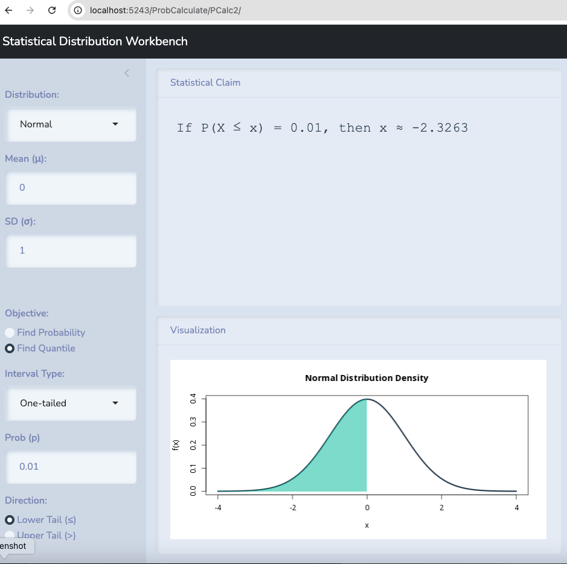

```{r setup,include=FALSE}
library(reticulate)
```


Operations, accounting, and finance applications are in order for the day.


# Slides

[Link is here](https://robertwwalker.github.io/BUS1301-SP26/slides/03-17-2026/index.html)


## The class plan:

1. Exploring applications and tools.  [Operations tool](https://robertwwalker.github.io/AI-Tools/ClaudeQueues/) and [some Finance and Accounting topics](https://robertwwalker.github.io/BUS1301-SP26/writeups/F-A-Models/index.html)

## Operations: AI Tools

9 focused AI applications within supply chain, logistics, and operations management:

1. **Demand Forecasting** — AI models ingest point-of-sale data, seasonality patterns, economic indicators, and even social media signals to predict SKU-level demand far more precisely than traditional statistical methods like moving averages or ARIMA models.

2. **Dynamic Inventory Positioning** — Rather than static reorder points, AI continuously recalculates optimal safety stock levels and reorder quantities across a distribution network, balancing carrying costs against stockout risk in real time.

3. **Supplier Risk Monitoring** — AI continuously scans news feeds, financial filings, geopolitical events, and weather data to flag suppliers at risk of disruption before it impacts your production schedule.

4. **Route Optimization & Last-Mile Delivery** — AI solves complex vehicle routing problems (VRP) at scale, factoring in traffic, delivery windows, driver hours-of-service rules, and fuel costs — recalculating dynamically as conditions change.

5. **Warehouse Slotting & Pick Path Optimization** — AI determines the optimal placement of SKUs within a warehouse based on velocity and co-purchase patterns, minimizing travel time for pickers and increasing throughput.

6. **Predictive Maintenance of Equipment** — AI analyzes sensor data from forklifts, conveyor systems, and CNC machines to predict failures before they cause unplanned downtime, enabling maintenance to be scheduled during off-peak hours.

7. **Production Scheduling & Sequencing** — AI optimizes job shop or flow shop scheduling by balancing machine capacity, labor availability, due dates, and changeover times — a problem too complex for manual planning at scale.

8. **Network Design & Facility Location** — AI-driven simulation and optimization models evaluate tradeoffs between warehouse locations, transportation lanes, and service levels to recommend the most cost-effective distribution network configuration.

9. **Freight Procurement & Spot Rate Prediction** — AI forecasts carrier spot market rates, helping logistics teams decide when to lock in contract rates versus use the spot market, and automates load tendering to preferred carriers based on cost and performance history.


# On Causality

Causation is at the heart of the highest order human reasoning.  Doing so with data is an objective if not an end result of modern fascination with machine learning.  Yet, these are age old philosophical questions and modern work at the intersection of data and causation is perhaps best exemplified in the work of Judea Pearl.  His most recent work, The Book of Why, details a lifetime of investigating causes and causal models at the intersection of computing, philosophy, and statistics.  Though wide ranging, [his podcast with Lex Fridman is worth listening to](https://share.google/FqVPW7tanZqALa2NM).  The excerpt on [correlation and causation is very useful.](https://www.youtube.com/watch?v=oFy2927b8jQ)

He develops a ladder of causation.  [This is quite well explained in this two page primer](https://web.cs.ucla.edu/~kaoru/3-layer-causal-hierarchy.pdf).

1. Associational

2. Interventional

3. Counterfactual

We want to understand precisely how these various levels influence what we learn from data and deploy data to accomplish.

[Judea Pearl’s website](https://bayes.cs.ucla.edu/home.htm)

The [book on statistics and causal inference](https://web.cs.ucla.edu/~kaoru/primer-complete-2019.pdf)

[A lecture on the Book of Why](https://youtu.be/nWaM6XmQEmU?si=nAtQu51kIfjoboBi)

Sections 2.1 to 2.10 of the Causal Mixtape are a [very succinct read](https://mixtape.scunning.com/02-probability_and_regression).


## Illustrating an Hypothesis Test with the Normal

Let's take the example of Berkeley.  Let's test the hypothesis that $\pi=0.5$ first and let's examine it with 99% confidence.

I will use the class tool to find that percentage.


Anything within 2.576 standard deviations above or below the mean is possible with 99% confidence.

The standard error in this case is 

$$\sqrt{\frac{\pi(1-\pi)}{n}}$$

This gives us $0.5 \pm z*$ `r sqrt(0.5*0.5/4526)`.

Or $0.5 \pm 0.019$.

Anything between 0.481 and 0.519 could be observed if 0.5 is true.

## A Single Tail

Let's take the example of Berkeley.  Let's test the hypothesis that $\pi \leq 0.5$ against the alternative that it is bigger and let's examine it with 99% confidence.

I will use the class tool to find that percentage.



Anything within 2.236 standard deviations above the mean is possible with 99% confidence.

The standard error in this case is 

$$\sqrt{\frac{\pi(1-\pi)}{n}}$$

This gives us $0.5 - z*$ `r sqrt(0.5*0.5/4526)`.

Or $0.5 + 2.236*0.019$.

Anything below 0.5166 could be observed if 0.5 or less is true.
