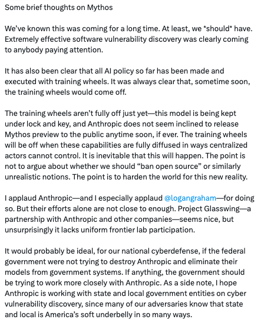
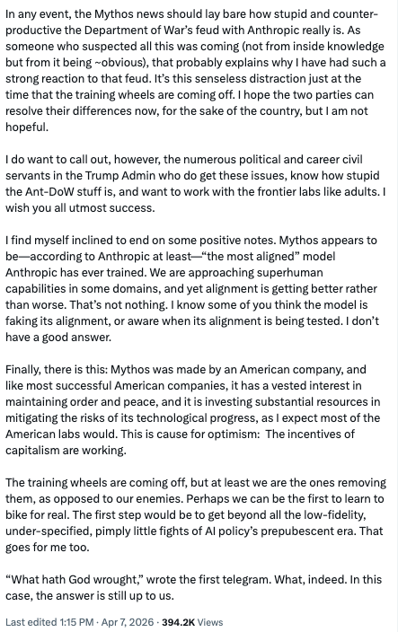

```{r setup,include=FALSE}
library(reticulate)
```

LLM's are models.  

<blockquote class="twitter-tweet"><p lang="en" dir="ltr">1/ today we&#39;re releasing muse spark, the first model from MSL. nine months ago we rebuilt our ai stack from scratch. new infrastructure, new architecture, new data pipelines. muse spark is the result of that work, and now it powers meta ai. 🧵 <a href="https://t.co/fThDXdsxwB">pic.twitter.com/fThDXdsxwB</a></p>&mdash; Alexandr Wang (@alexandr_wang) <a href="https://twitter.com/alexandr_wang/status/2041909376508985381?ref_src=twsrc%5Etfw">April 8, 2026</a></blockquote> <script async src="https://platform.twitter.com/widgets.js" charset="utf-8"></script>

## A Discussion Item

<blockquote class="twitter-tweet"><p lang="en" dir="ltr">Some brief thoughts on Mythos<br><br>We’ve known this was coming for a long time. At least, we *should* have. Extremely effective software vulnerability discovery was clearly coming to anybody paying attention. <br><br>It has also been clear that all AI policy so far has been made and…</p>&mdash; Dean W. Ball (@deanwball) <a href="https://twitter.com/deanwball/status/2041610761433174180?ref_src=twsrc%5Etfw">April 7, 2026</a></blockquote> <script async src="https://platform.twitter.com/widgets.js" charset="utf-8"></script>

## The full thought






## Slides

[Slides](https://robertwwalker.github.io/BUS1301-SP26/slides/04-09-2026/index.html)

## The class plan:

1. Models and inputs: the prompt.
2. Prompting techniques.       
3. Local LLMs and details of implementation.    
LO: Refining inputs to an LLM to improve the quality of outputs

Ethics: Do organizations have a responsibility to train employees on AI usage?

Readings:
- Prompting Techniques

