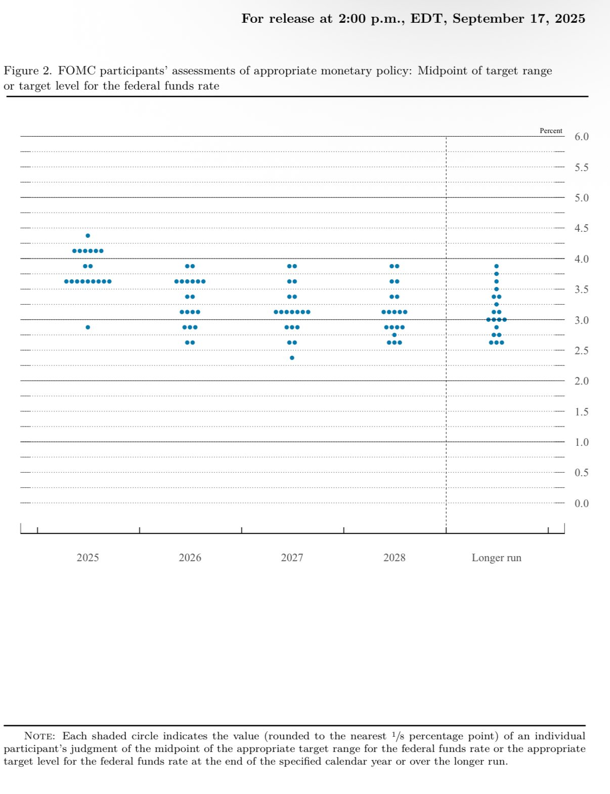
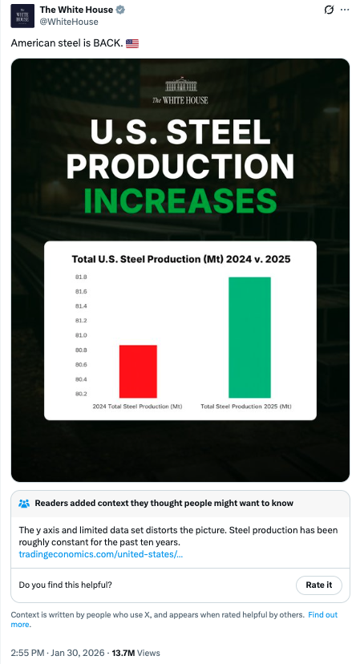

```{r setup, include=FALSE}
library(tidyverse) 
library(dplyr)
library(reticulate)
knitr::opts_chunk$set(fig.retina=3, fig.height=6, fig.width=9, echo=TRUE, eval=TRUE)
```

# The Basics


## The Dot Plot [it's really a beeswarm]



[the link](https://x.com/elerianm/status/1968398113170932130?s=51)

# Overview

- [The Economist: Mistakes](https://medium.economist.com/mistakes-weve-drawn-a-few-8cdd8a42d368)
- Tables
- Probability


# Scatterplots [Lines just connect points]

## Finishing Plots

::: {.callout-important}
Prompt: create a scatterplot of returns by assets
:::

```{python, echo=FALSE}
import pandas as pd
import matplotlib.pyplot as plt
import seaborn as sns

# Load the dataset
df = pd.read_csv('BondFunds.csv')

# Create the scatterplot
plt.figure(figsize=(8, 5))
sns.scatterplot(data=df, x='Assets', y='Return 2009', alpha=0.7)

# Adding titles and labels
plt.title('Scatterplot of 2009 Returns by Assets')
plt.xlabel('Assets (in millions)')
plt.ylabel('Return 2009 (%)')
plt.grid(True, linestyle='--', alpha=0.6)

plt.tight_layout()
```

##

::: {.callout--important}
Prompt: create a scatterplot of expense ratios and returns with symbols from fees and colors from risk
:::

```{python, echo=FALSE}
# Define categorical order for Risk
risk_order = ['Below average', 'Average', 'Above average']
df['Risk'] = pd.Categorical(df['Risk'], categories=risk_order, ordered=True)

# Create the scatterplot
plt.figure(figsize=(10, 6))
scatter = sns.scatterplot(
    data=df, 
    x='Expense Ratio', 
    y='Return 2009', 
    hue='Risk', 
    style='Fees', 
    s=100, 
    alpha=0.8
)

# Styling
plt.title('Scatterplot of 2009 Returns vs. Expense Ratio')
plt.xlabel('Expense Ratio (%)')
plt.ylabel('Return 2009 (%)')
plt.grid(True, linestyle='--', alpha=0.5)

# Adjust legend
plt.legend(bbox_to_anchor=(1.05, 1), loc='upper left')

plt.tight_layout()
```

##

::: {.callout-important}
Prompt: use a checkmark for yes and an X for no as the symbols
:::

```{python, echo=FALSE}
# Define categorical order for Risk
risk_order = ['Below average', 'Average', 'Above average']
df['Risk'] = pd.Categorical(df['Risk'], categories=risk_order, ordered=True)

# Define custom markers: Check for 'Yes', X for 'No'
# Matplotlib supports LaTeX for markers.
markers = {"Yes": r'$\checkmark$', "No": "X"}

# Create the scatterplot
plt.figure(figsize=(9, 6))
# Note: Using style and markers together
scatter = sns.scatterplot(
    data=df,
    x='Expense Ratio',
    y='Return 2009',
    hue='Risk',
    style='Fees',
    markers=markers,
    s=150,  # Increased size for better visibility of the custom markers
    alpha=0.8
)

# Styling
plt.title('2009 Returns vs. Expense Ratio (Risk Color-coded, Fees by Symbol)')
plt.xlabel('Expense Ratio (%)')
plt.ylabel('Return 2009 (%)')
plt.grid(True, linestyle='--', alpha=0.5)

# Adjust legend
plt.legend(bbox_to_anchor=(1.05, 1), loc='upper left', title="Risk / Fees")

plt.tight_layout()
```

## plotly

```{python, echo=FALSE, results="hide", include=FALSE}
import plotly.express as px

# Ensure Risk has a logical order
risk_order = ['Below average', 'Average', 'Above average']

# Create the interactive scatter plot
fig = px.scatter(
    df, 
    x='Expense Ratio', 
    y='Return 2009', 
    color='Risk', 
    symbol='Fees',
    symbol_map={'Yes': 'star', 'No': 'x'},
    category_orders={'Risk': risk_order},
    title='2009 Returns vs. Expense Ratio',
    labels={
        'Expense Ratio': 'Expense Ratio (%)', 
        'Return 2009': 'Return 2009 (%)'
    },
    # Hovering shows additional details like Fund Number and Type
    hover_data=['Fund Number', 'Type', 'Assets'],
    template='plotly_white'
)

# Customize marker appearance
fig.update_traces(marker=dict(size=12, opacity=0.8, line=dict(width=1, color='DarkSlateGrey')))
```

```{python, echo=FALSE}
fig.show()
```

## ECDFs and Probability: A Link

```{python, echo=FALSE}
# Create the figure with two subplots side by side
fig, axes = plt.subplots(1, 2, figsize=(12, 6))

# 1. ECDF of Assets Overall
sns.ecdfplot(data=df, x='Assets', ax=axes[0])
axes[0].set_title('ECDF of Assets (Overall)')
axes[0].set_xlabel('Assets (in millions)')
axes[0].set_ylabel('Proportion')
axes[0].grid(True, linestyle='--', alpha=0.5)

# 2. ECDF of Assets by Type
sns.ecdfplot(data=df, x='Assets', hue='Type', ax=axes[1])
axes[1].set_title('ECDF of Assets by Fund Type')
axes[1].set_xlabel('Assets (in millions)')
axes[1].set_ylabel('Proportion')
axes[1].grid(True, linestyle='--', alpha=0.5)

# Adjust layout
plt.tight_layout()
```


# Do's and Dont's

[The Economist: Mistakes](https://medium.economist.com/mistakes-weve-drawn-a-few-8cdd8a42d368)



# Where do data come from?


# Where do data come from?

What does your book have to say?

# Where do data come from?

- Surveys.  
- Macroeconomic aggregates.  
- Sensors and passive collection.   
- Mall intercepts.   

# Westwood 2025

Bots change the value of survey data.


# For Next Time

Read, if you have not already, the CDC Framework, paying particular attention to credible evidence.

What is Goodhart's Law?

What is Campbell's Law?