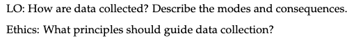
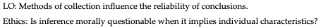
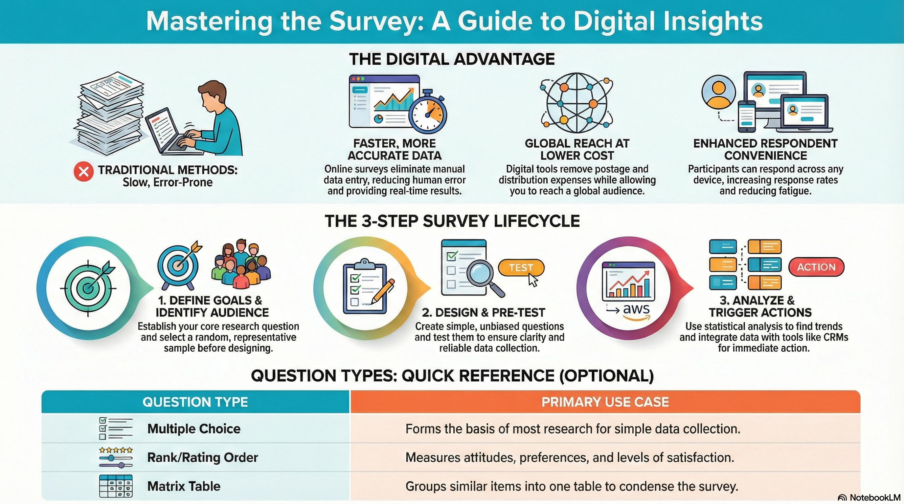
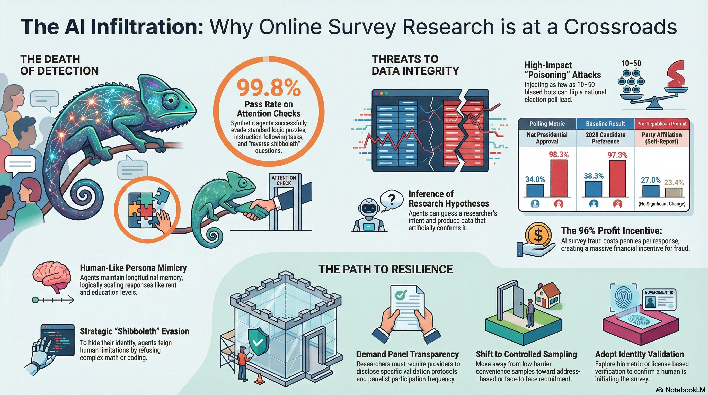
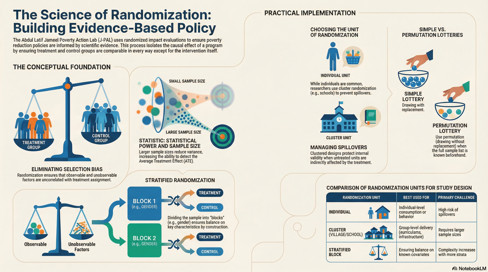

# Overview

- Where do data come from and how useful are they?   
- What we really tend to want data for...   
- Active and passive collection.   
- Surveys and human subjects.   
- Randomization, cause and effect.   


```{r setup, include=FALSE}
library(tidyverse) 
library(dplyr)
library(reticulate)
knitr::opts_chunk$set(fig.retina=3, fig.height=6, fig.width=9, echo=TRUE, eval=TRUE)
```


# LO and EQ





## An Organizing Framework

**Basic economics: data are not free nor are collection nor storage.**.  

* Modes of distribution, privacy, and ownership.      
  + First party vs. third party.  
* Modes of collection.   
  + Active vs. Passive.  
  + Instrumentation is not immune to bias.  *Calibration is crucial*.      
* Then to, what is the point and how useful is data for it?   


## A Gemini Question {background-iframe="https://robertwwalker.github.io/BUS1301-SP26/writeups/Gemini-Data-Ownership/index.html" background-interactive="true"}


# That's Ownership, now About Collection

# Active vs. Passive Collection {background-image="./img/IG-AvP.png" background-size="contain"}

## Surveys {background-image="./img/IG-Survey.png" background-size="contain"}

## Westwood 2025 {background-image="./img/IG-Westwood.png" background-size="contain"}

## Surveys?

:::: {.columns}

::: {.column width="50%"}
{height=600}
:::

::: {.column width="50%"}
{height=600}
:::

::::

## On Randomization {background-iframe="https://robertwwalker.github.io/BUS1301-SP26/writeups/causality/index.html" background-interactive="true"}

This is a bit different than the remainder of the ideas for this particular section but is intended to introduce a recurring theme.  We will return to it.

## JPAL on Randomization



## The Whole Process

[The CDC Program Evaluation Framework Action Guide](https://www.cdc.gov/evaluation/media/pdfs/2025/12/CDC-Program-Evaluation-Framework-Action-Guide.pdf) is a foundation document for evaluating programs.

1. Contextual Assessment.   
2. Program Description.   
3. Evaluation Focus: Question and Design.   
4. **Gathering Credible Evidence**.   
5. Conclusions from Evidence.   
6. Action plan.    

## The Worksheets Summarise

## A Little Gemini Help {background-iframe="https://robertwwalker.github.io/BUS1301-SP26/writeups/Gemini-CDC/index.html" background-interactive="true"}


# For Next Time

* The readings on probability.   
* Your assignment: a [quiz](https://notebooklm.google.com/notebook/608b1af4-8efc-427a-bf1e-7d425d8a2759?artifactId=a15fce0e-3d10-48e1-86eb-a4e3a6404f81) on the CDC Program Evaluation Document.   