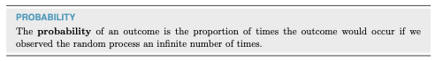
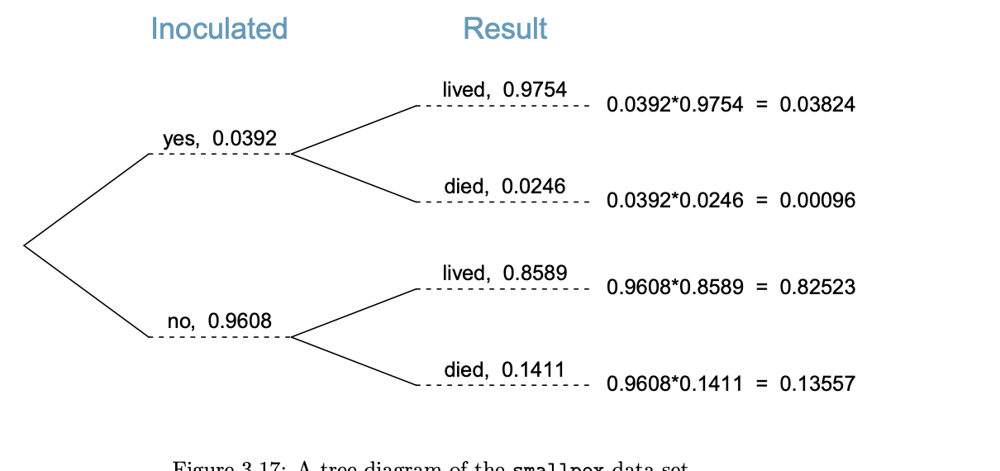

```{r setup, include=FALSE}
library(tidyverse) 
library(dplyr)
library(reticulate)
knitr::opts_chunk$set(fig.retina=3, fig.height=6, fig.width=9, echo=TRUE, eval=TRUE)
```

# Overview

- The ECDF.   
- Tables
- Probability

## ECDFs and Probability: A Link

Empirical Cumulative Distribution Functions
* the y-axis is always a proportion [0-1]/percentage [0/100].  

```{python, echo=FALSE}
import pandas as pd
import matplotlib.pyplot as plt
import seaborn as sns

# Load the dataset
df = pd.read_csv('BondFunds.csv')
# Create the figure with two subplots side by side
fig, axes = plt.subplots(1, 2, figsize=(12, 6))

# 1. ECDF of Assets Overall
sns.ecdfplot(data=df, x='Assets', ax=axes[0])
axes[0].set_title('ECDF of Assets (Overall)')
axes[0].set_xlabel('Assets (in millions)')
axes[0].set_ylabel('Proportion')
axes[0].grid(True, linestyle='--', alpha=0.5)

# 2. ECDF of Assets by Type
sns.ecdfplot(data=df, x='Assets', hue='Type', ax=axes[1])
axes[1].set_title('ECDF of Assets by Fund Type')
axes[1].set_xlabel('Assets (in millions)')
axes[1].set_ylabel('Proportion')
axes[1].grid(True, linestyle='--', alpha=0.5)

# Adjust layout
plt.tight_layout()
```


# Probability and Tables

## Probability

```{r, echo=FALSE}
load(url("https://github.com/robertwwalker/DADMStuff/raw/master/Week3Data.RData"))
library(png); library(kableExtra)
Prob.Def <- readPNG("img/ETJ-Probability.png")
grid::grid.raster(Prob.Def)
```

## Why Jaynes?

His approach is intuitive.  If you are familiar with probability already, some of you have formal training, Appendix A sets out the key differences.  The nominal assignment is to read this with the assistance of NotebookLM and Gemini.  It is not the easiest, but his ideas on subjective probability are important.

Why did I ask you to read this?  He builds a basic foundation.  He derives rules.  Those rules are the same rules that we will deploy.  But he does it from more basic foundations.  Yes, he can do math. That's not the point; there is a simple representation of all of these ideas.  And only a small number of rules that we will define precisely.

**His books taught me a great deal, personally.**

# Probability

Two rules:   

1. Probabilities sum to one.
2. The probability of any event is greater than or equal to zero.

## Where does Probability Come From?

There are three common sources of probabilities:

- Known formula [Dice, Coins, etc.]
- Empirical frequency
- Subjective belief

**Jaynes is a proponent of the latter.**

## The Book



**The infinity bit is opinionated.  Hence the reliance on the law of large numbers.**

## A priori probability

The probability of a given integer on a k-sided die: $\frac{1}{k}$.

The probability of **heads** with a fair coin: $\frac{1}{2}$.

The probability of a Queen?  $\frac{4}{52}$

The probability of a Diamond?  $\frac{13}{52}$

The Queen of Diamonds? $\frac{1}{52}$ or   $(\frac{4}{52}\times\frac{13}{52})$

**Quasirandom numbers**

## Empirical probability: frequency

How often does something happen?




[Straight to Watch](https://www.youtube.com/watch?v=tgC-vZp07YM)

## This is Historical Statistics

How likely am I to be admitted? *Consult the admissions rate*

How fast do I drive? *Likelihood of law enforcement and need for speed*

In data: this is tables.

## Berkeley

::::{.columns}

::: {.column width="50%"}

```{r MD1, echo=FALSE}
library(tidyverse)
library(janitor)
table(UCBAdmit$M.F,UCBAdmit$Admit)
UCBAdmit %>% tabyl(M.F, Admit)
```

:::

::: {.column width="50%"}

```{r MD2, eval=FALSE}
library(tidyverse)
library(janitor)
table(UCBAdmit$M.F,UCBAdmit$Admit)
UCBAdmit %>% tabyl(M.F, Admit)
```

:::

::::

## Three Versions

::::{.columns}

::: {.column width="50%"}

```{r MD1B}
prop.table(table(UCBAdmit$M.F,UCBAdmit$Admit), 1)
prop.table(table(UCBAdmit$M.F,UCBAdmit$Admit), 2)
prop.table(table(UCBAdmit$M.F,UCBAdmit$Admit))
```

:::


::: {.column width="50%"}

```{r MD2B}
UCBAdmit %>% tabyl(M.F, Admit) %>% adorn_percentages("row")
UCBAdmit %>% tabyl(M.F, Admit) %>% adorn_percentages("col")
UCBAdmit %>% tabyl(M.F, Admit) %>% adorn_percentages("all")
```

:::

::::

## Plot It

```{r}
( UCBM <- ggplot(UCBAdmit) + aes(x=M.F, fill=Admit) + geom_bar(position="dodge") + scale_fill_viridis_d() )
```

More on this later.


## Subjective Probability

How likely **do we believe** something is?


## The Great Divide

Empirical frequency vs. subjective belief

# Empirical Frequency: She's Right  

## Physics Disagrees: We Goin Nova.....


## Annie's a liar.

What matters in group decision making is probably as much the beliefs [subjective] as the evidence [frequency].

How should we reflect this in strategies of argumentation/persuasion?

## Think

What matters?

```{r, eval=TRUE, echo=FALSE}
# RUN ME
# may need to install.packages("countdown")
library(countdown)
countdown_fullscreen(
  minutes = 5, seconds = 0,
  margin = "5%",
  font_size = "8em",
)
```

## Disjoint events/mutual exclusivity

Outcomes are called disjoint or mutually exclusive if they cannot both occur.

## Three Concepts from Set Theory

- Intersection [and]
- Union [or] **avoid double counting the intersection**
- Complement [not]

## Three Distinct Probabilities

- Joint: Pr(x=x and y=y)
- Marginal: Pr(x=x) or Pr(y=y)
- Conditional: Pr(x=x | y=y) or Pr(y =y | x = x)

## Joint Probability

**The table sums to one**.  

For Berkeley:

```{r}
UCBAdmit %>% tabyl(M.F, Admit) %>% adorn_percentages("all")
prop.table(table(UCBAdmit$M.F,UCBAdmit$Admit))
```

## Marginal Probability

**The row/column sums to one**.  We collapse the table to a single margin.  Here, two can be identified.  The probability of Admit and the probability of M.F.  

::::{.columns}

::: {.column width="50%"}

```{r}
UCBAdmit %>% tabyl(M.F)
UCBAdmit %>% tabyl(Admit)
```

:::


::: {.column width="50%"}

```{r}
prop.table(table(UCBAdmit$M.F))
prop.table(table(UCBAdmit$Admit))
```
:::

::::

## Conditional Probability

How does one margin of the table break down given values of another?  **Each row or column sums to one**  

Four can be identified, the probability of admission/rejection for Male, for Female; the probability of male or female for admits/rejects.

For Berkeley:

::::{.columns}

::: {.column width="50%"}

```{r}
UCBAdmit %>% tabyl(M.F, Admit) %>% adorn_percentages("row")
prop.table(table(UCBAdmit$M.F,UCBAdmit$Admit), 1)
```

:::


::: {.column width="50%"}

```{r}
UCBAdmit %>% tabyl(M.F, Admit) %>% adorn_percentages("col")
prop.table(table(UCBAdmit$M.F,UCBAdmit$Admit), 2)
```

:::

::::

## Law of Total Probability

Is a combination of the distributive property of multiplication and the fact that probabilities sum to one.

For example, the probability of Admitted and Male is the probability of admission for males times the probability of male.

$$ Pr(x=x, y=y) = Pr(y | x)Pr(x) $$

Or it is the probability of being admitted times the probabilty of being male among admits.

$$ Pr(x=x, y=y) = Pr(x | y)Pr(y) $$


## Now the Substance

::::{.columns}

::: {.column width="50%"}
The `ggplot` fill aesthetic is great for displaying these things.   For example, are males and females equally likely to be admitted to Berkeley?

**Plaintiffs say no.**

```{r, echo=TRUE, eval=FALSE}
ggplot(UCBAdmit) + aes(x=M.F, fill=Admit) + geom_bar() + scale_fill_viridis_d()
```
:::

::: {.column width="50%"}
```{r, echo=FALSE}
ggplot(UCBAdmit) + aes(x=M.F, fill=Admit) + geom_bar() + scale_fill_viridis_d()
```
:::

::::

## Is that an Adequate Comparison?

::::{.columns}

::: {.column width="50%"}

The University says no.  Why?  The most important factor in the probability of admission is likely to be the department.  This has a huge impact on what we see.


```{r, eval=FALSE}
ggplot(UCBAdmit) + 
  aes(x=M.F, fill=Admit) + 
  geom_bar(position="fill") + 
  scale_fill_viridis_d() + 
  facet_wrap(vars(Dept))
```
:::

::: {.column width="50%"}
```{r, eval=TRUE, echo=FALSE}
ggplot(UCBAdmit) + aes(x=M.F, fill=Admit) + geom_bar(position="fill") + scale_fill_viridis_d() + facet_wrap(vars(Dept))
```

:::

::::


## The Magic of Bayes Rule

To find the joint probability [the intersection] of x and y, we can use either of the aforementioned methods.  To turn this into a conditional probability, we simply take it is a proportion of the relevant margin.

$$ Pr(x | y) = \frac{Pr(y | x) Pr(x)}{Pr(y)} $$

## Applications of these Topics

## A Bit on Juries

- Start from Section 3.2.7
- The juror's decision tree



Three nodes: guilty and not at each, convict at the third.

## Bayesian Reasoning is Core to Decisions with Data {background-image="img/BayesRuleRWW.jpeg"}
[
$$ Pr(Decision | data) = \frac{Pr(data | Decision) Pr(Decision)}{Pr(Data)} $$
]{style="color:red;"}

