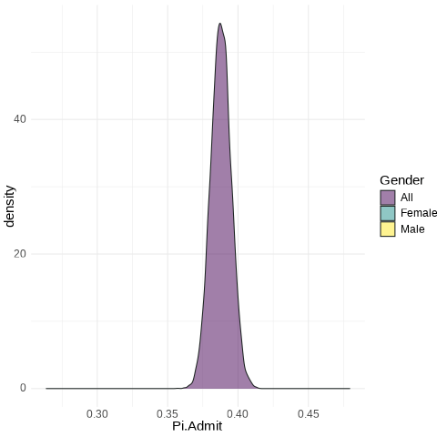

```{r setup, include=FALSE}
knitr::opts_chunk$set(warning=FALSE, message=FALSE, echo=TRUE, comment=NA, prompt=FALSE, fig.height=6, fig.width=6.5, fig.retina = 3, dev = 'svg', dev.args = list(bg = "white"), eval=TRUE)
library(tidyverse)
```


# Bernoulli Trials

## The Generic Bernoulli Trial

Suppose the variable of interest is discrete and takes only two values: yes and no.  For example, is a customer satisfied with the outcomes of a given service visit?  

For each individual, because the probability of yes (1) $\pi$ and no (0) 1-$\pi$ must sum to one, we can write:

$$f(x|\pi) = \pi^{x}(1-\pi)^{1-x}$$


# Binomial Distribution

For multiple identical trials, we have the Binomial:

$$f(x|n,\pi) = {n \choose k} \pi^{x}(1-\pi)^{n-x}$$
where $${n \choose k} = \frac{n!}{(n-k)!k!}$$


## Scottish Pounds

*Informal surveys suggest that 15% of Essex shopkeepers will not accept Scottish pounds.  There are approximately 200 shops in the general High Street square.*

1. Draw a plot of the distribution of shopkeepers that do not accept Scottish pounds.

```{r}
Scots <- data.frame(Potential.Refusers = 0:200) %>% mutate(Prob = round(pbinom(Potential.Refusers, size=200, 0.15), digits=4))
Scots %>% ggplot() + aes(x=Potential.Refusers, y=Prob) + geom_point() + labs(x="Refusers", y="Prob. of x or Less Refusers") + theme_minimal() -> Plot1
Plot1
```


## A Nicer Plot

:::: {.columns}
::: {.column width="40%"}

```{r, eval=FALSE}
library(plotly)
p <- ggplotly(Plot1)
p
```

:::
::: {.column width="60%"}

```{r, echo=FALSE}
library(plotly)
p <- ggplotly(Plot1)
p
```
        
:::
::::

## More Questions About Scottish Pounds

2. What is the probability that 24 or fewer will not accept Scottish pounds?

```{r}
pbinom(24, 200, 0.15)
```


3. What is the probability that 25 or more shopkeepers will not accept Scottish pounds?

```{r}
1-pbinom(24, 200, 0.15)
```


4. With probability 0.9 [90 percent], XXX or fewer shopkeepers will not accept Scottish pounds.

```{r}
qbinom(0.9, 200, 0.15)
```


## Application: The Median is a Binomial with p=0.5

Interestingly, any given observation has a 50-50 chance of being *over* or *under* the median.  Suppose that I have five datum.  

1. What is the probability that all are under?

```{r}
pbinom(0,size=5, p=0.5)
```

2. What is the probability that all are over?

```{r}
dbinom(5,size=5, p=0.5)
```

3. What is the probability that the median is somewhere in between our smallest and largest sampled values?

**Everything else**.  $1 - (0.03125 + 0.03125) = 0.9375$

## The Rule of Five

| Number Bigger | Probability |
|-----|---------|
| 0 | 1*0.03125 |
| 1 | 5*0.03125 |
| 2 | 10*0.03125 |
| 3 | 10*0.03125 |
| 4 | 5*0.03125 |
| 5 | 1*0.03125 |


- This is called the *Rule of Five* by Hubbard in his *How to Measure Anything*.


## Geometric Distributions

How many failures before the first success?  Now defined exclusively by $p$.  In each case, (1-p) happens $k$ times.  Then, on the $k+1^{th}$ try, p.  Note 0 failures can happen...

$$Pr(y=k) = (1-p)^{k}p$$


## Example: Entrepreneurs

Suppose any startup has a $p=0.1$ chance of success.  How many failures?


```{r GP1, echo=FALSE}
par(mfrow=c(1,2))
plot(x=seq(0,30,1),y=dgeom(seq(0,30,1),0.1), xlab="Failures", ylab="Pr(Exactly XXX Failures)", main="Pr(Success)=0.1", type="h")
plot(x=seq(0,30,1),y=pgeom(seq(0,30,1),0.1), xlab="Failures", ylab="Pr(Less or XXX Failures)", main="Pr(Success)=0.1", type="h")
```


## Example: Entrepreneurs

Suppose any startup has a $p=0.1$ chance of success.  How many failures for the average/median person?

```{r}
qgeom(0.5,0.1)
```


5. [Geometric] Plot 1000 random draws of "How many vendors until one refuses my Scottish pounds?"

```{r}
Geoms.My <- data.frame(Vendors=rgeom(1000, 0.15))
Geoms.My %>% ggplot() + aes(x=Vendors) + geom_histogram(binwidth=1)
```


We could also do something like.

```{r}
plot(seq(0,60), pgeom(seq(0,60), 0.15))
```


## Negative Binomial Distributions

How many failures before the $r^{th}$ success?  In each case, (1-p) happens $k$ times.  Then, on the $k+1^{th}$ try, we get our $r^{th}$ p.  Note 0 failures can happen...

$$Pr(y=k) = {k+r-1 \choose r-1}(1-p)^{k}p^{r}$$

## Needed Sales

I need to make 5 sales to close for the day.  How many potential customers will I have to have to get those five sales when each customer purchases with probability 0.2.

```{r}
library(patchwork)
DF <-  data.frame(Customers = c(0:70)) %>% 
  mutate(m.Customers = dnbinom(Customers, size=5, prob=0.2), 
         p.Customers = pnbinom(Customers, size=5, prob=0.2)) 
pl1 <- DF %>% ggplot() + aes(x=Customers) + geom_line(aes(y=p.Customers)) 
pl2 <- DF %>% ggplot() + aes(x=Customers) + geom_point(aes(y=m.Customers))
```


```{r, echo=FALSE}
pl1 + pl2
```


## Simulation: A Powerful Tool

In this last example, I was concerned with sales.  I might also want to generate revenues because I know the rough mean and standard deviation of sales.  Combining such things together forms the basis of a Monte Carlo simulation.


## An Example

Customers arrive at a rate of 7 per hour.
You convert customers to buyers at a rate of 85%.
Buyers spend, on average 600 dollars with a standard deviation of 150 dollars.

```{r}
Sim <- 1:1000
Customers <- rpois(1000, 7)
Buyers <- rbinom(1000, size=Customers, prob = 0.85)
Data <- data.frame(Sim, Buyers, Customers)
Data <- Data %>% group_by(Sim) %>% mutate(Revenue = sum(rnorm(Buyers, 600, 150))) %>% ungroup()
```


# Simulation Results

```{r Plot1, echo=FALSE}
library(patchwork)
p1 <- ggplot(Data) + aes(x=Customers) + geom_histogram(binwidth = 1) + theme_minimal()
p2 <- ggplot(Data) + aes(x=Buyers) + geom_histogram(binwidth=1) + theme_minimal()
p3 <- ggplot(Data) + aes(x=Revenue) + geom_density() + theme_minimal()
(p1 + p2) / p3
```

## A Summary

Distributions are how variables and probability relate.  They are a graph that we can enter in two ways.  From the probability side to solve for values or from values to solve for probability.  It is always a function of the graph.

Distributions generally have to be sentences. 

- The name is a noun but it also has 
- parameters -- verbs -- that makes the noun tangible.

# Inference of Two Types: Binary and Numeric

# Discrete Inference [Binary]

```{r setup2, include=FALSE}
knitr::opts_chunk$set(cache=TRUE, warning=FALSE, message=FALSE, echo=TRUE, tidy=TRUE, comment=NA, prompt=FALSE, fig.height=6, fig.width=6.5, fig.retina = 3, dev = 'svg', eval=TRUE)
library(ggplot2)
options(
  digits = 3,
  width = 75,
  ggplot2.continuous.colour = "viridis",
  ggplot2.continuous.fill = "viridis",
  ggplot2.discrete.colour = c("#D55E00", "#0072B2", "#009E73", "#CC79A7", "#E69F00", "#56B4E9", "#F0E442"),
  ggplot2.discrete.fill = c("#D55E00", "#0072B2", "#009E73", "#CC79A7", "#E69F00", "#56B4E9", "#F0E442")
)
library(fontawesome)
library(DT)
library(magrittr)
options(scipen=8)
library(tidyverse)
library(gganimate)
library(hrbrthemes)
theme_set(theme_ipsum_rc())
```


## How do we learn from data?


* **It is probably better posed as, what can we learn from data?**.  

## The Big Idea

### Inference

In the most basic form, learning something about data that we do not have from data that we do.  In the jargon of statistics, we characterize the probability distribution of some feature of the population of interest from a sample drawn randomly from that population. 

### Quantities of Interest:  

- **Single Proportion**: *The probability of some qualitative outcome with appropriate uncertainty.^[Which will itself be a probability measure.]*   

- **Single Mean**: *The average of some quantitative outcome with appropriate uncertainty.<sup>1</sup>*    

## The Big Idea
  
### **Inference**
  
In the most basic form, learning something about data that we do not have from data that we do.  In the jargon of statistics, we characterize the probability distribution of some feature of the population of interest from a sample drawn randomly from that population.  

### Quantities of Interest:  

- **Compare Proportions**: *Compare key probabilities across two groups with appropriate uncertainty.^[Which will itself be a probability measure.]*

- **Compare Means**: *Compare averages/means across two groups with appropriate uncertainty.<sup>1</sup>*

## The Big Idea
  
### **Inference**
  
In the most basic form, learning something about data that we do not have from data that we do.  In the jargon of statistics, we characterize the probability distribution of some feature of the population of interest from a sample drawn randomly from that population. 

### Study Planning  

*Plan studies of adequate size to assess key probabilities of interest.*   
  
## Inference for Data
  
Of two forms:
  
1. Binary/Qualitative
2. Quantitative

We will first focus first on the former.  But before we do, one new concept.  

## The **standard error**  

It is the *degree of variability of a statistic* just as the standard deviation is the *variability in data*. 

- The standard error of a proportion is $\sqrt{\frac{\pi(1-\pi)}{n}}$ while the standard deviation of a binomial sample would be $\sqrt{n*\pi(1-\pi)}$. 

- The standard deviation of a sample is $s$ while the standard error of the mean is $\frac{s}{\sqrt{n}}$.  The average has less variability than the data and it shrinks as n increases.

## Let's think about an election....

Consider election season.  *The key to modeling the winner of a presidential election is the electoral college in the United States.*  In almost all cases, this involves a series of binomial variables.

- Almost all states award electors for the statewide winner of the election and DC has electoral votes.

- We have polls that give us likely vote percentages at the state level.  Call it `p.win` for the probability of winning.  We can then deploy `rbinom(1000, size=1, p.win)` to derive a hypothetical election.  

- Rinse and repeat to calculate a hypothetical electoral college winner.  But how do we calculate `p-win`?
  
- **We infer it from polling data**

## An Interesting Post on the Mechanics

[Post](https://www.niemanlab.org/2020/07/this-is-how-fivethirtyeight-is-trying-to-build-the-right-amount-of-uncertainty-into-its-2020-election-data-analysis/)
  
## Qualitative: The Binomial
  
Is entirely defined by two parameters, $n$ -- the number of subjects -- and $\pi$ -- the probability of a positive response.  The probability of exactly $x$ positive responses is given by:
  
$$ Pr(X = x | \pi, n) = {n \choose x} \pi^x (1-\pi)^{n-x} $$
  
The binomial is the `canonical` distribution for binary outcomes.  *Assuming all $n$ subjects are alike and the outcome occurs with $\pi$ probability*,^[If this does not hold, we will seek the homogenous groups in which it does.] then we must have a sample from a binomial.  *A binomial with $n=1$ is known as a Bernoulli trial* 

## Features of the Binomial

Two key features:

1. Expectation: $n \cdot \pi$ or number of subjects times probability, $\pi \textrm{ if } n=1$.

2. Variance is $n \cdot \pi \cdot (1 - \pi)$  or $\pi(1-\pi) \textrm{ if } n=1$ and standard deviation is $\sqrt{n \cdot \pi \cdot (1 - \pi)}$ or $\sqrt{\pi(1-\pi)} \textrm{ if } n=1$.

## Data

Now let's grab some data and frame a question.

```{r}
load(url("https://github.com/robertwwalker/DADMStuff/raw/master/Big-Week-6-RSpace.RData"))
```


## Berkeley Admissions {.smaller}
  
What is the probability of being admitted to UC Berkeley Graduate School?^[We probably think this depends on a bunch of applicant specific features but we will put that to the side for now.]  

. . .   
  
I have three variables: 

1. Admitted or not

2. Gender 

3. The department an applicant applied to.

<span style="color: green;">Admission is the key.</span>

```{r}
library(janitor) #<<
UCBTab <- data.frame(UCBAdmissions) %>% reshape::untable(., .$Freq) %>% select(-Freq) 
UCBTab %>% tabyl(Admit)  # Could also use UCBTab %$% table(Admit) 
```

The proportion is denoted as $\hat{p}$.  We can also do this with *table*.

---

```{r, eval=require('DT')}
UCBTab %>% DT::datatable(.,fillContainer = FALSE, options = list(pageLength = 8), rownames=FALSE)
```

## A Visual

```{r, fig.height = 5, fig.align='center'}
library(viridisLite)
UCBTab %>% ggplot(.) + aes(x = Gender, fill = Admit) + geom_bar() + scale_fill_viridis_d()
```

## The Idea

Suppose we want to know $\pi(Admit)$ -- the probability of being admitted -- with 90% probability.  

We want to take the data that we saw and use it to **infer** the likely values of $\pi(Admit)$.  

## Three interchangeable methods

1. Resampling/Simulation

2. Exact binomial computation

3. A normal approximation


## Method 1: Resampling

**Suppose I have 4526 chips with 1755 <span style="color: green;">green</span> and 2771 <span style="color: red;">red</span>.**  

. . .

I toss them all on the floor

. . .

and pick them up, one at a time, 

. . .

record the value (<span style="color: green;">green</span>/<span style="color: red;">red</span>), 

. . .

put the chip back,  
*[NB: I put it back to avoid getting exactly the same `sample` every time.]*

. . .

and repeat 4526 times.  


**Each count of <span style="color: green;">green chips</span> as a proportion of 4526 total chips constitutes an estimate of the probability of Admit.**

. . .

I wrote a little program to do just this -- `ResampleProps`.  
```
remotes::install_github("robertwwalker/ResampleProps")
```

## Resampling Result

```{r}
library(ResampleProps)
RSMP <- ResampleProp(UCBTab$Admit, k = 10000, tab.col = 1) %>% data.frame(Pi.Admit=., Gender=as.character("All"), frameN = 1) 
quantile(RSMP$Pi.Admit, probs = c(0.05,0.95))
```

What is our estimate of $\pi$ with 90% confidence?   

*The probability of admission ranges from `r round(quantile(RSMP$Pi.Admit, probs = c(0.05,0.95))[[1]], 3)` to `r round(quantile(RSMP$Pi.Admit, probs = c(0.05,0.95))[[2]], 3)`.*


## A Plot

```{r, fig.height= 5, fig.align='center'}
library(ggthemes)
RSMP %>%  ggplot(., aes(x=Pi.Admit)) + geom_density(outline.type = "upper", color="maroon") +labs(x=expression(pi)) + theme_minimal()
```


## Another Way: Exact binomial

That last procedure is correct but it is overkill.

1. With probability of 0.05, how small could $\pi$ be to have gotten `r table(UCBTab$Admit)[[1]]` of `r sum(table(UCBTab$Admit))` or more?  

2. With probability 0.95, how big could $\pi$ be to have gotten  fewer than `r table(UCBTab$Admit)[[1]]` of `r sum(table(UCBTab$Admit))`?

```{r}
UCBTab %$% table(Admit) #<<
```

. . .

**`binom.test` does exactly this.**

## `binom.test()`

```{r}
UCBTab %$% table(Admit) %>% binom.test(conf.level = 0.9)
Plot.Me <- binom.test(1755, 1755+2771, conf.level=0.9)$conf.int %>% data.frame()
```

**With 90% probability, now often referred to as 90% confidence to avoid using the word probability twice, the probability of being admitted ranges between 0.3758 and 0.3998.**

## Illustrating the Binomial

```{r}
UCBTab %$% table(Admit) %>% binom.test(conf.level = 0.9)
c(pbinom(1755, 1755+2771, 0.3998340), pbinom(1754, 1755+2771, 0.3757924))
```

---

```{r, fig.width=10, fig.align='center'}
Binomial.Search <- data.frame(x=seq(0.33,0.43, by=0.001)) %>% mutate(Too.Low = pbinom(1755, 1755+2771, x), Too.High = 1-pbinom(1754, 1755+2771, x))
Binomial.Search %>% pivot_longer(cols=c(Too.Low,Too.High)) %>% ggplot(., aes(x=x, y=value, color=name)) + geom_line() + geom_hline(aes(yintercept=0.05)) + geom_hline(aes(yintercept=0.95))  + geom_vline(data=Plot.Me, aes(xintercept=.), linetype=3) + labs(title="Using the Binomial to Search", color="Greater/Lesser", x=expression(pi), y="Probability")
```

## A Third Way: The normal approximation

As long as $n$ and $\pi$ are sufficiently large, we can approximate this with a normal distribution.  **This will also prove handy for a related reason.**  

As long as $n*\pi$ > 10, we can write that a standard normal $z$ describes the distribution of $\pi$, given $n$ -- the sample size and $\hat{p}$ -- the proportion of yes's/true's in the sample.

$$ Pr(\pi) = \hat{p} \pm z \cdot \left( \sqrt{\frac{\hat{p}*(1-\hat{p})}{n}} \right) $$

$R$ implements this in `prop.test`.  By default, R implements a modified version that corrects for discreteness/continuity.  To get the above formula exactly, `prop.test(table, correct=FALSE)`.

## A first look at hypotheses {.smaller}

$$ z = \frac{\hat{p} - \pi}{\sqrt{\frac{\pi(1-\pi)}{n}}} $$

With some proportion calculated from data $\hat{p}$ and some claim about $\pi$ -- hereafter called an **hypothesis** -- we can use $z$ to calculate/evaluate the claim. These claims are *hypothetical* values of $\pi$.  They can be evaluated against a specific alternative considered in three ways:

- two-sided, that is $\pi = value$ against not equal.  

- $\pi \geq value$ against something smaller.  

- $\pi \leq value$ against something greater.  

In the first case, either much bigger or much smaller values could be evidence against equal.  The second and third cases are always about smaller and bigger; they are one-sided.

Just as $z$ has metric standard deviations now referred to as standard errors of the proportion, the z here will measure where the data fall with respect to the hypothetical $\pi$.  

*With z sufficiently large, and in the proper direction, our hypothetical $\pi$ becomes unlikely given the evidence and should be dismissed.*

## Three hypothesis tests

```{r}
( Z.ALL <- (0.3877596 - 0.5)/(sqrt(0.5^2 / 4526)) ) # Calculate z 
```

*The estimate is 15.1 standard errors below the hypothesized value.*

::::{.columns}

::: {.column width="50%"}

### Two Sided

$\pi = 0.5$ against $\pi \neq 0.5$.
```{r}
pnorm(-abs(Z.ALL)) + (1-pnorm(abs(Z.ALL))) 
```

Any $|z| > 1.64$ -- probability 0.05 above and below -- is sufficient to dispense with the hypothesis.

:::

::: {.column width="50%"}

### One-Sided

$\pi \leq 0.5$ against $\pi \gt 0.5$.

With 90% confidence, $z > 1.28$ is sufficient.

$\pi \geq 0.5$ against $\pi \lt 0.5$.

With 90% confidence, $z < -1.28$ is sufficient.

:::

::::

## The normal approximation {.smaller}

```{r}
prop.test(table(UCBTab$Admit), conf.level = 0.9, correct=FALSE)
```

$R$ reports the result as $z^2$ not $z$ which is $\chi^2$ not normal; we can obtain the $z$ by taking a square root: $$\sqrt{228.08} \approx 15.1 $$

This approximation yields an estimate of $\pi$, with 90% confidence, that ranges between `r round(prop.test(table(UCBTab$Admit), conf.level = 0.9, correct=FALSE)$conf.int[[1]], 3)` and `r round(prop.test(table(UCBTab$Admit), conf.level = 0.9, correct=FALSE)$conf.int[[2]], 3)`.


## A Cool Consequence of Normal {.smaller}

The formal equation defines:

$$ z = \frac{\hat{p} - \pi}{\sqrt{\frac{\pi(1-\pi)}{n}}} $$

Some language:

1. Margin of error is $\hat{p} - \pi$.  [MOE]

2. Confidence: the probability coverage given z [two-sided].

3. We need a guess at the true $\pi$ because variance/std. dev. depend on $\pi$.  0.5 is common because it maximizes the variance; we will have enough no matter what the true value.

Algebra allows us to solve for $n$.

$$ n = \frac{z^2 \cdot \pi(1-\pi)}{(\hat{p} - \pi)^2} $$

## Example

Estimate the probability of supporting an initiative to within 0.03 with 95% confidence.  Assume that the probability is 0.5 [it maximizes the variance and renders a conservative estimate -- an upper bound on the sample size]

```{r}
Sample.Size <- function(MOE, B.pi=0.5, Conf.lev=0.95) { 
  My.n <- ((qnorm((1-Conf.lev)/2)^2)*(B.pi*(1-B.pi))) / MOE^2 
  Necessary.sample <- ceiling(My.n) 
  return(Necessary.sample) 
}
Sample.Size(MOE=0.03, B.pi=0.5, Conf.lev = 0.95)
```

**I need 1068 people to estimate support to within plus or minus 0.03 with 95% confidence.**

## In the Real World

```{r, echo=FALSE, out.height="300px", out.width="900px"}
y1 <- "https://i.imgur.com/Fp2nuNN.png"
download.file(y1, './y1.png')

```

[A real poll](https://navigatorresearch.org/wp-content/uploads/2020/04/Navigator-Daily-Tracker-Topline-F04.13.20.pdf).  They do not have quite enough for a 3% margin of error.  But 1006 is enough for a 3.1 percent margin of error...

```{r}
Sample.Size(MOE=0.031, B.pi=0.5, Conf.lev = 0.95)
```


## One More Oddity

What is our estimate of $\pi$ with 90% confidence?  

**The probability of admission ranges from `r quantile(RSMP$Pi.Admit, probs = c(0.05,0.95))[[1]]` to `r quantile(RSMP$Pi.Admit, probs = c(0.05,0.95))[[2]]`.**

If we wish to express this using the normal approximation, a central interval is the observed proportion plus/minus $z$ times the *standard error of the proportion* -- $$ SE(\hat{p}) = \sqrt{\frac{\hat{p}(1-\hat{p})}{n}} $$  NB: The sample value replaces our assumed true value because $\pi$ is to be solved for.  For 90%, the probability of admissions ranges from

```{r}
0.3877596 + qnorm(c(0.05,0.95))*(sqrt(0.3877596*(1-0.3877596)/4526))
```

# Back to the Story

**Does the probability of admission depend on whether the applicant is Male or Female?**

## Analysis by Group

```{r}
library(janitor); UCBTab %>% tabyl(Gender,Admit) %>% adorn_totals("col")
UCBTab %>% tabyl(Gender,Admit) %>% adorn_percentages("row")
UCBTF <- UCBTab %>% filter(Gender=="Female")
UCBTF.Pi <- ResampleProp(UCBTF$Admit, k = 10000) %>%  data.frame(Pi.Admit=., Gender=as.character("Female"), frameN=2) # Estimates for females
UCBTM <- UCBTab %>% filter(Gender=="Male")
UCBTM.Pi <- ResampleProp(UCBTM$Admit, k = 10000) %>%  data.frame(Pi.Admit=., Gender = as.character("Male"), frameN = 2)  # Estimates for males
```

## Binomial Result: Males

```{r BinomMale}
UCBTM %$% table(Admit) %>% binom.test(., conf.level = 0.9)
```

The probability of being admitted, conditional on being Male, ranges from 0.43 to 0.46 with 90% confidence.


## The Thought Experiment: Male

```{r BMPlot, fig.align='center'}
UCBTM.Pi %>%  ggplot(., aes(x=Pi.Admit)) + geom_density(color="maroon") + labs(x=expression(pi))
```


## Binomial Result: Females

```{r BinomF}
UCBTF %$% table(Admit) %>% binom.test(., conf.level = 0.9)
```

The probability of being of Admitted, given a Female, ranges from 0.286 to 0.322 with 90% confidence.

## The Thought Experiment: Female

```{r BFPlot, fig.align='center'}
UCBTF.Pi %>%  ggplot(., aes(x=Pi.Admit)) + geom_density(color="maroon") + labs(x=expression(pi))
```

## Succinctly

:::: {.columns}

::: {.column width="30%"}

Female: from 0.286 to 0.322  
Male: from 0.43 to 0.46  
All: from 0.3758 to 0.3998  
:::

::: {.column width="70%"}

```{r patch1, fig.width=9, echo=FALSE}
library(patchwork)
ggplot(UCBTab) +aes(x = Gender, fill = Admit) + geom_bar(color="darkgreen", position = "dodge") +  labs(x="") + scale_fill_viridis_d() + ggplot(UCBTab) +aes(x = Gender, fill = Admit) + geom_bar(color="darkgreen", position = "fill") + guides(fill="none") + labs(y="Proportion", x="") + scale_fill_viridis_d()
```

:::

::::

## A Key Visual

```{r Yellow, message=FALSE, warning=FALSE, fig.width=9, fig.height=5, fig.align='center', dev="jpeg"}
UCB.Pi <- bind_rows(UCBTF.Pi, UCBTM.Pi)
UCB.Pi %>% ggplot(., aes(x=Gender, y=Pi.Admit, fill=Gender)) + geom_violin() + geom_label(aes(x=1.5, y=0.375), label="Too small to be male \n Too large to be female?", size=14, fill="black", color="white", inherit.aes = FALSE) + guides(size="none") + labs(x="") + scale_fill_viridis_d()
```

---

:::: {.columns}

::: {.column width="30%"}


```{r GGAnim, eval=FALSE, warning=FALSE, message=FALSE, results='hide'}
UCB.Pi <- bind_rows(UCBTF.Pi, UCBTM.Pi, RSMP)
UCB.Pi %>% ggplot(., aes(x=Pi.Admit, fill=Gender)) + geom_density(alpha=0.5) + theme_minimal() +  scale_fill_viridis_d() + transition_states(frameN, state_length = 40, transition_length = 20) + enter_fade() + exit_fade() -> SaveAnim
anim_save(SaveAnim, renderer = gifski_renderer(height=500, width=1000), filename="img/Anim1.gif")
```

:::

::: {.column width="70%"}



:::

::::

## Can We Measure the Difference?

:::: {.columns}

::: {.column width="50%"}
How much more likely are Males to be admitted when compared to Females?

**We can take the difference in our estimates for Male and Female.**

```{r Diff, tidy=FALSE}
UCB.Diff <- UCB.Pi %>% filter(frameN != 1) %>% select(Pi.Admit, Gender) %>% mutate(obs = rep(seq(1:10000),2)) %>% pivot_wider(., id_cols = obs, values_from=Pi.Admit, names_from=Gender) %>% mutate(Diff = Male - Female)
quantile(UCB.Diff$Diff, probs=c(0.05,0.95))
```

```{r GGP1, eval=FALSE}
ggplot(UCB.Diff) + aes(x=Diff) + geom_density() + labs(title="Difference in Probability of Admission", subtitle="[Male - Female]")
```

:::

::: {.column width="50%"}

```{r, echo=FALSE}
ggplot(UCB.Diff) + aes(x=Diff) + geom_density() + labs(title="Difference in Probability of Admission", subtitle="[Male - Female]")
```
:::

::::

## Or Use the Normal Approximation

$$[\hat{p}_{M} - \hat{p}_{F}] \pm z*\sqrt{ \underbrace{\frac{\hat{p}_{M}(1-\hat{p}_{M})}{n_{M}}}_{Males} + \underbrace{\frac{\hat{p}_{F}(1-\hat{p}_{F})}{n_{F}}}_{Females}}$$

```{r}
# prop.test(table(UCBTab$Gender,UCBTab$Admit), conf.level=0.9, correct=FALSE)
UCBTab %$% table(Gender, Admit) %>% prop.test(conf.level = 0.9, correct=FALSE)
```

With 90% confidence, a Female is 0.118 to 0.165 [0.1416] less likely to be admitted.

## The Standard Error of the Difference

Following something akin to the FOIL method, we can show that the variance of a difference in two random variables is the sum of the variances minus twice the covariance between them.

$$Var(X - Y) = Var(X) + Var(Y) - 2*Cov(X,Y) $$

If we assume [or recognize it is generally unknownable] that the male and female samples are independent, the covariance is zero, and the variance of the difference is simply the sum of the variance for male and female, respectively, and **zero covariance**.

$$SE(\hat{p}_{M} - \hat{p}_{F}) =  \sqrt{ \underbrace{\frac{\hat{p}_{M}(1-\hat{p}_{M})}{n_{M}}}_{Males} + \underbrace{\frac{\hat{p}_{F}(1-\hat{p}_{F})}{n_{F}}}_{Females}}$$  

## The chi-square and the test of independence

The sum of $k$ squared standard normal (z or Normal(0,1)) variates has a $\chi^2$ distribution with $k$ degrees of freedom.  Two sample tests of proportions can be reported using the chi-square metric as well.  $R$'s `prop.test` does this by default.
