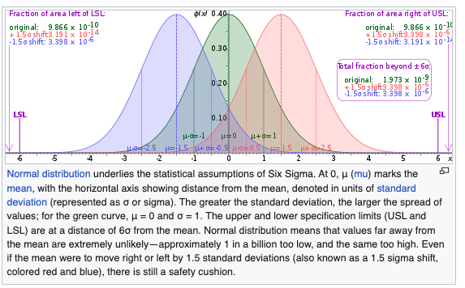

```{r setup, include=FALSE}
knitr::opts_chunk$set(warning=FALSE, message=FALSE, echo=TRUE, comment=NA, prompt=FALSE, fig.height=6, fig.width=6.5, fig.retina = 3, dev = 'svg', dev.args = list(bg = "white"), eval=TRUE)
library(tidyverse)
library(magrittr)
library(fontawesome)
library(DT)
library(magrittr)
options(scipen=8)
library(tidyverse)
library(gganimate)
library(hrbrthemes)
theme_set(theme_ipsum_rc())
options(htmltools.dir.version = FALSE)
knitr::opts_chunk$set(warning=FALSE, message=FALSE, comment=NA, prompt=FALSE, fig.height=6, fig.width=6.5, fig.retina = 3, dev = 'svg', dev.args = list(bg = "white"))
library(xaringanthemer); library(kableExtra); library(tidyverse); library(skimr)
options(scipen=6)
black.box.maker <- function(mod1) {
            d1 <- dim(mod1$model)[[1]]
            sumsq1 <- var(mod1$model[,1], na.rm=TRUE)*(d1-1)
            rt1 <- sqrt(sumsq1)
            sumsq2 <- var(mod1$fitted.values, na.rm=TRUE)*(d1-1)
            rsquare <- round(sumsq2/sumsq1, digits=4)
            rt2 <- sqrt(sumsq2)
            plot(x=NA, y=NA, xlim=c(0,rt1), ylim=c(0,rt1), main=paste("R-squared:",rsquare), xlab="", ylab="", bty="n", cex=0.5)
            polygon(x=c(0,0,rt1,rt1), y=c(0,rt1,rt1,0), col="black")
            polygon(x=c(0,0,rt2,rt2), y=c(0,rt2,rt2,0), col="green")
}

black.box.maker.NT <- function(mod1) {
            d1 <- dim(mod1$model)[[1]]
            sumsq1 <- var(mod1$model[,1], na.rm=TRUE)*(d1-1)
            rt1 <- sqrt(sumsq1)
            sumsq2 <- var(mod1$fitted.values, na.rm=TRUE)*(d1-1)
            rsquare <- round(sumsq2/sumsq1, digits=4)
            rt2 <- sqrt(sumsq2)
            plot(x=NA, y=NA, xlim=c(0,rt1), ylim=c(0,rt1), main="", xlab="", ylab="", bty="n", cex=0.5)
            polygon(x=c(0,0,rt1,rt1), y=c(0,rt1,rt1,0), col="black")
            polygon(x=c(0,0,rt2,rt2), y=c(0,rt2,rt2,0), col="green")
}
```

## A Model

For our purposes, it is a systematic description of a phenomenon that shares important and essential features of that phenomenon.  Models frequently give us leverage on problems in the absence of alternative approaches.

## One Review Problem: Six Sigma

$6\sigma$ is a widely used tool in TQM [total quality management].  But $6\sigma$ isn't actually $6\sigma$.  The famous mantra that goes with it is 3.4 dipmo [defects per million opportunities].  This means that the outer limit [and it only considers one-sided/tailed] on defects is 0.0000034.

## The Probability Distribution {.smaller}

:::: {.columns}

::: {.column width="40%"}
```{r}
options(scipen=8)
library(radiant)
result <- prob_norm(mean = 0, stdev = 1, plb = 0.0000034)
summary(result, type = "probs")
```

$6\sigma$ is only $4.5$.



:::

::: {.column width="60%"}
```{r}
plot(result, type = "probs") + theme_minimal()
```
:::

::::

## Take Away

There are two sources of variation: realizations and averages and both vary.  4.5 $\sigma$ in the data and $1.5\sigma$ in the average.  Total is six.

## Simulating Operations

[A Queue Laboratory](https://robertwwalker.github.io/AI-Tools/ClaudeQueues/)

## Accounting and Finance Applications

[A Web Writeup](https://robertwwalker.github.io/BUS1301-SP26/writeups/F-A-Models/index.html)