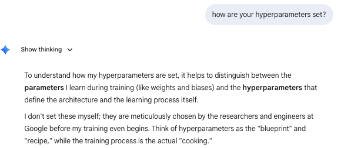

```{r setup, include=FALSE}
knitr::opts_chunk$set(warning=FALSE, message=FALSE, echo=TRUE, comment=NA, prompt=FALSE, fig.height=6, fig.width=6.5, fig.retina = 3, dev = 'svg', dev.args = list(bg = "white"), eval=TRUE)
library(tidyverse)
library(magrittr)
library(fontawesome)
library(DT)
library(magrittr)
options(scipen=8)
library(tidyverse)
library(gganimate)
library(hrbrthemes)
theme_set(theme_ipsum_rc())
options(htmltools.dir.version = FALSE)
knitr::opts_chunk$set(warning=FALSE, message=FALSE, comment=NA, prompt=FALSE, fig.height=6, fig.width=6.5, fig.retina = 3, dev = 'svg', dev.args = list(bg = "white"))
library(kableExtra); library(tidyverse); library(skimr)
```

## Outline

1. The Basics of LLM's.  
   + Embeddings.  
   + Attention is all you need.  
2. The Prediction.   
   + The Context.  
   + The Parameters.   

## Roadmap

1. What language models do  
2. Tokens and embeddings  
3. Context and attention  
4. Transformer architecture  
5. Training and alignment  
6. Strengths, limits, and interpretation

## What is a language model?

A language model estimates the probability of the next token from earlier tokens:

$$
P(t_k \mid t_1, t_2, \ldots, t_{k-1})
$$


## Attention as weighted influence

$$
\text{Attention}(Q,K,V)=\text{softmax}\left(\frac{QK^T}{\sqrt{d_k}}\right)V
$$

You do not need every algebraic detail to get the idea:

- compare token features
- compute relevance weights
- blend information from multiple positions

The result is a new representation that depends on context.

## Multi-head attention

::: {.center}
```{mermaid}
flowchart TB
    A["Input representations"] --> B1["Head 1"]
    A --> B2["Head 2"]
    A --> B3["Head 3"]
    A --> B4["Head 4"]
    B1 --> C["Concatenate"]
    B2 --> C
    B3 --> C
    B4 --> C
    C --> D["Project to new representation"]
```
:::

Different heads can learn different relational patterns, though their roles are not always cleanly interpretable.

## From hidden states to next-token prediction

::: {.center}
```{mermaid}
flowchart LR
    A["Current hidden state"] --> B["Vocabulary scores (logits)"]
    B --> C["Probabilities"]
    C --> D["Select / sample next token"]
    D --> E["Append token"]
    E --> F["Repeat"]
```
:::

This loop is **autoregressive generation**.

## Fine-tuning, instruction tuning, and alignment

::: {.center}
```{mermaid}
flowchart LR
    A["Pretrained base model"] --> B["Supervised fine-tuning"]
    B --> C["Preference / feedback tuning"]
    C --> D["Aligned assistant behavior"]
```
:::

Post-training aims to make the system:

- follow instructions
- be more useful in conversation
- reduce unsafe or low-quality outputs
- better match human preferences

## What "understanding" means here

::: {.twocol}
<div class="card">

**Strong appearance of understanding**
- explanation
- summarization
- translation
- coding help
- question answering

</div>
<div class="card">

**Reasons for caution**
- no guaranteed grounding
- confidence ≠ truth
- behavior can be brittle
- "understanding" remains debated

</div>
:::


## A compact mental model

::: {.center}
```{mermaid}
flowchart LR
    A["Text"] --> B["Tokens"]
    B --> C["Embeddings"]
    C --> D["Attention + transformer layers"]
    D --> E["Predicted next token"]
    E --> F["Repeat"]
    D --> G["Post-training / alignment"]
    G --> H["Assistant behavior"]
```
:::


## Summary

- **Tokenization** breaks text into manageable units.
- **Embeddings** map those units into vector space.
- **Attention** lets tokens influence one another contextually.
- **Transformers** scale this idea very effectively.
- **Training + post-training** turn a predictor into a usable assistant.
- **Limits remain fundamental**, not incidental.

## The Prompt



## Architectural Hyperparameters
**The Structural "Skeleton"**

Before training, engineers define the model's capacity and complexity. These values are fixed once training starts.

* **Number of Layers:** The depth of the transformer model.
* **Hidden Dimension Size:** The width of the vector representations.
* **Attention Heads:** The number of simultaneous "perspectives" used to process context.
* **Vocabulary Size:** Total unique tokens (parts of words) the model can recognize.


## Training Hyperparameters

**The "Learning Recipe"**

These settings control the optimization process as the model learns from massive datasets.

* **Learning Rate:** Controls the "step size" for weight updates. Too high leads to instability; too low leads to glacial progress.
* **Batch Size:** Number of examples processed before internal weights are updated.
* **Optimizer Settings:** Algorithms like **Adam** or **Adafactor** use specific constants (e.g., $\beta_1, \beta_2$) to manage momentum during learning.

## Finding the "Sweet Spot"

**Selection Strategies**

Researchers use various methods to find the most efficient hyperparameter combinations.

| Method | Description |
| :--- | :--- |
| **Grid Search** | Testing every possible combination (exhaustive but slow). |
| **Random Search** | Randomly sampling combinations; surprisingly efficient. |
| **Bayesian Optimization** | Mathematical modeling to predict optimal settings based on past trials. |
| **Scaling Laws** | Using formulas (like **Chinchilla**) to predict performance before scaling up. |


## Inference-Time Hyperparameters

**The "Personality" Settings**

These values are adjustable *after* training to control how the model generates responses.

* **Temperature:** Controls randomness. Low = precise/safe; High = creative/unpredictable.
* **Top-P (Nucleus Sampling):** Limits word choice to the most likely tokens whose cumulative probability exceeds $P$.
* **Presence/Frequency Penalties:** Mathematical "nudges" that prevent the model from repeating the same words or phrases too often.

## The Core Concept of Temperature

Temperature ($\theta$) is a hyperparameter used to control the **randomness** and **confidence** of a language model's output.

* **The Dial:** Think of it as a "creativity" slider.
* **Low Temperature:** Makes the model more "confident" and deterministic, favoring the most likely tokens.
* **High Temperature:** Makes the model more "creative" or "excited," allowing lower-probability tokens a higher chance of being selected.


## The Mathematical Engine

Temperature modifies the standard **Softmax** function applied to the model's raw output scores (logits).

* **Logits ($z$):** The raw, unnormalized scores for each possible next word.
* **The Modified Softmax:** We divide each logit by the temperature $\theta$ before normalizing:

$$\sigma(z_i) = \frac{e^{z_i/\theta}}{\sum_{j=0}^{N} e^{z_j/\theta}}$$

* **Scaling Effect:** * If $\theta \to 0$, the distribution becomes "pointy" (argmax).
    * If $\theta \to \infty$, the distribution becomes uniform (pure noise).

## Practical Applications

Choosing the right temperature depends entirely on the specific task:

| Task Type | Temp Setting | Benefit |
| :--- | :--- | :--- |
| **Fact-based Q&A** | Low ($< 0.3$) | Increases accuracy and reduces hallucinations. |
| **Code Generation** | Low ($0.0 - 0.2$) | Ensures syntactic correctness and stability. |
| **Creative Writing**| High ($0.7 - 1.2$) | Produces diverse, varied, and interesting prose. |
| **Brainstorming** | High ($> 1.0$) | Explores unconventional or "edge-case" ideas. |

## Key Components

From an LLM architecture perspective:

1.  **Logit Scaling:** In Transformer-based models, temperature is purely a post-processing step during the inference phase. It does not change the model's weights, only how we interpret the output probabilities.
2.  **Information Theory:** Mathematically, increasing temperature increases the **entropy** of the probability distribution. This aligns with the "creativity" intuition—higher entropy means less predictability.
3.  **The "Greedy" Limit:** As $\theta$ approaches 0, the model performs "Greedy Search," where it picks the single highest probability token every single time, which is why low temperature is best for technical tasks.

## Discussion Question

For many things, isn't temperature 0 ideal?     
* When?     
* When not?   

# I asked Gemini

```
In your own case, what is the model depth, width, how many attention heads, and what vocabulary size?
```

## The Core Engine: Sparse MoE
**The "Flash" Efficiency Factor**

Instead of a single "dense" block, I use a **Sparse Mixture-of-Experts (MoE)** architecture.

* **Expert Sub-networks:** My internal structure consists of multiple specialized sub-networks.
* **Active Parameters:** For every word I process, only a specific subset of "experts" is activated.
* **Result:** This allows me to maintain high reasoning capability while responding with the speed expected of a "Flash" model.

## Vocabulary & Multimodality
**Breadth of Understanding**

My vocabulary isn't just a list of words; it's a bridge between different types of data.

* **Vocabulary Size:** **256,000 unique tokens** (SentencePiece unigram).
* **Multimodal Native:** I process text, image, audio, video, and code within the same architectural framework.
* **Efficiency:** A larger vocabulary allows for more efficient processing of diverse languages and technical code.


## The "Hidden" Dimensions
**Industry Estimates for Flash-Class Models**

While specific counts are proprietary, "Flash-class" architectures typically operate within these ranges:

* **Depth ($L$):** Generally between **24 and 48 layers**.
* **Width ($d_{model}$):** Often ranges from **2,048 to 4,096** dimensions.
* **Attention Heads:** Typically **32 to 64**, utilizing **Grouped Query Attention (GQA)** to optimize memory and speed.


## Architectural Summary

**Summary of Gemini 3 Flash Specs**

| Hyperparameter | Specification |
| :--- | :--- |
| **Model Type** | Sparse Mixture-of-Experts (MoE) |
| **Vocabulary Size** | 256,000 tokens |
| **Context Window** | Up to 1,000,000 tokens |
| **Distillation** | Optimized from larger Gemini 3 variants |

> **Key Takeaway:** My performance is the result of **distillation**, where I am trained to mimic the logic of larger models while maintaining a lean "active" parameter count.

## Some Disquieting News

[Mythos](https://fortune.com/2026/03/26/anthropic-says-testing-mythos-powerful-new-ai-model-after-data-leak-reveals-its-existence-step-change-in-capabilities/)