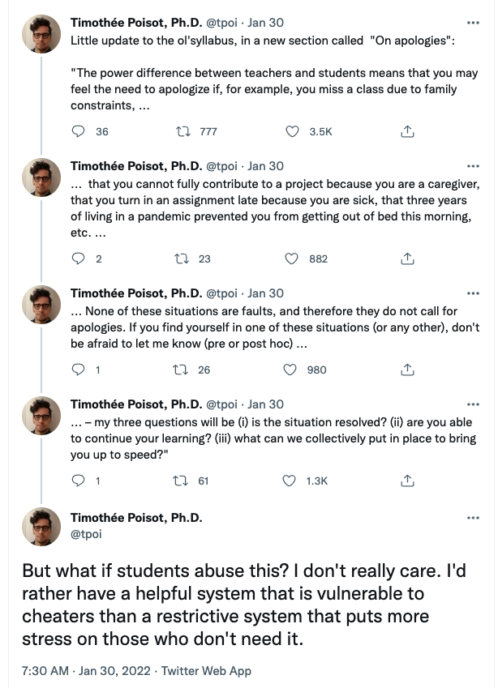

```{r setup, include=FALSE}
knitr::opts_chunk$set(echo = TRUE)
library(timeDate)
library(tibble)
library(dplyr)
library(knitr)

#This code chunk sets up a table of meeting days for the course.
#You can set days of the week for course meetings (e.g. Monday and Wednesday).
#Semester start and end dates are selected and then university holidays like spring break are specified.

#Days of the week that the course meets. Must be full day name in quotes.
Days <- c("Tuesday","Thursday")

#Semester start date for classes as YYYY/M/D.
SemesterStart <- as.Date("2026/01/12")

#Semester end date for classes as YYYY/M/D.
SemesterEnd <- as.Date("2026/04/28")

#Fall break start and stop date.
FallBreak <-
  seq.Date(
    from = as.Date("2024/11/27"),
    to = as.Date("2024/11/29"),
    by = "day"
  )

#Spring break start and stop date.
SpringBreak <-
  seq.Date(
    from = as.Date("2026/03/23"),
    to = as.Date("2026/03/27"),
    by = "day"
  )

#Creates a list of days within the semester.
SemesterDays <-
  seq.Date(from = SemesterStart, to = SemesterEnd, by = "day")

#Add day before Thanksgiving.
DayBeforeThnks<-as.Date(holiday(
    year = getRmetricsOptions("currentYear"),
    Holiday = c("USThanksgivingDay")))-1

AdvDay<-as.Date("2026-04-07")

#Full list of holidays that there are no classes including breaks.
Holidays <-
  c(as.Date(holiday(
    year = getRmetricsOptions("currentYear"),
    Holiday = c("USLaborDay", "USThanksgivingDay", "USMLKingsBirthday")
  )), SpringBreak, FallBreak, DayBeforeThnks, AdvDay)

#Create a list of semester days excluding holidays.
SemesterDays <- SemesterDays[!SemesterDays %in% Holidays]

#Make dataframe with all semester days.
ClassDays <- data.frame(index = 1:length(SemesterDays))

#Insert dates.
ClassDays$Date <- SemesterDays

#Insert weekday designation.
ClassDays$Weekday <- weekdays(ClassDays$Date)

#Limit to the class meeting days.
MeetingDays <- ClassDays[ClassDays$Weekday %in% Days, ]

#Create numeric list of weeks.
Week <- cut.Date(MeetingDays$Date, breaks = "week")
levels(Week) <- 1:length(levels(Week))

MeetingDays$Week <- Week
MeetingDays$Class <- 1:nrow(MeetingDays)

#Replace this with c("Lecture topic 1",...,"Lecture topic N") to fill in table.

Lecture_Topic <- 1:nrow(MeetingDays)


MeetingDays <- bind_cols(MeetingDays, Lecture = Lecture_Topic)

#### Grade table ####
Grades <- tribble( ~ Grade,
                   ~ Range,
                   "A",
                   "95-100",
                   "A-",
                   "90-94.5",
                   "B+",
                   "85-89.5",
                   "B",
                   "80-84.5",
                   "B-",
                   "75-79.5",
                   "C",
                   "70-74.5",
                   "C-",
                   "65-69.5",
                   "D+",
                   "60-64.5",
                   "D",
                   "55-59.5",
                   "F",
                   "0-54.5")

####Assignment weight table####
Weights <- tribble(
                    ~ Item,
                    ~ Weight,
                    "Complete/Non-Complete",
                    "30 %",
                    "Group Projects [3]",
                    "35 %",
                    "Assessments",
                    "35 %",
                  )
```

## Course description

This course will introduce students to how managers and organizations collect, process, and interpret observations about the world around them to facilitate informed decisions with the aid of models including those of artificial intelligence. The first portion of the course introduces students to models, the concept of data, and the use of data in workplace settings. Students will learn different practical methods of data gathering -- from surveys and archives to experiments and crowd sourcing and explore basic methods of organizing data for robust and sustainable deployment. With data in hand, we explore how managers can use data, highlighting the incredible value resulting from cross tabulation, frequency distributions, and simple plots.  This value is enhanced with basic statistical inference and populating models with data.  One of the greatest barriers to linking data and decisions was the necessary computing; artificial intelligence tools have fundamentally changed that. The final portion of the course will focus on the use of artificial intelligence (AI), highlighting general features of how commonly deployed AI systems function and how they can solve challenges across various areas of business and explore the likely future.

Information is a resource; it should be used judiciously and efficiently.  While a wealth of information is available at our fingertips, high quality information can remain a surprisingly scarce resource.  We are inundated with data, facts, and figures that only become actionable through identifying meaningful patterns and trends, developing fundamental managerial insights, and extracting information essential to inform effective managerial decisions. The tools of this course are among the most important tools of effective managers.

While effective, there is a sense in which limitations imposed by linking decisions to measures and data are reductionist, potentially misleading, and pose potentially deep ethical challenges.  Mindful of the central role that ethics must play in shaping organizational pursuits, we will tackle these challenges head on though only you can ground these in your deepest moral sentiments.

# Course goals

Upon successful completion of this course, you should --

1. Distinguish various means of data collection and discuss their tradeoffs.
2. Describe common models of data management and their tradeoffs.
3. Understand the basics of relational databases and the ways that they are combined.
4. Articulate the application of common analytic techniques, their function, and their domain of application.
5. Comfortably discuss AI's historical development, current functionality, and valid use cases.
6. Recognize and evaluate the myriad ethical concerns in data, analytics, and artificial intelligence.
7. Be able to utilize AI tools [and verify their veracity] for performing data analysis and decision support.

# Course Materials

The primary organizing resource for the course is the __Open Introduction to Statistics__.  It is open and freely available in a variety of digital formats.  Paper copies can be obtained as well if you so choose.


```
Diez, David M., Christopher D. Barr, and Mine Cetinkaya-Rundel.  2019.  
  OpenIntro Statistics: Fourth Edition.
```

Additional course materials – readings, examples, and exercises – will be posted regularly to our Canvas course site and the class website.  I maintain Files and a Pages document with .pdfs and links on Canvas and will frequently link things via the course website on github.

To access the university sites, you will be prompted for your Willamette University login in order to gain access to course materials.  The course will combine the use of Excel or Sheets for many tasks but we have reached an age where what once were difficult computing barriers have become trivial for LLM tools.  We will exploit them.

Slides are always posted before class.  Supplemental resources can be found on Canvas.

# Policies

## Individuals and Groups

This course will require you to complete both individual assignments and group assignments. For individual assignments, I do not allow any form of student collaboration. I define student collaboration as any assistance given from one student to another student. Please feel free to talk with me before you engage in any activity that might satisfy the definition of “collaboration”; I would be happy to provide you my guidance on whether or not the activity is acceptable. By enrolling in this course, you agree to be held to my definition of “individual assignments” and “student collaboration.” For group assignments, students can and should work interactively, making it difficult to distinguish who completed which portions of the project. In the list of deliverables below, I designate individual work and group work.

## AI Tools and Their Use

Exams with integrity are a challenge.  I am not restricting use of AI tools at all for your exam prep memos or for class exercises. However, you must keep two things in mind: using an AI system does not absolve you from the need to cite others’ work and you have to verify any information that an AI system provides. You will receive point deductions for uncited or incorrect information, as well as for uncited incorrect information (the latter sounds strange, but it can happen if you echo someone else’s erroneous ideas). You also must disclose when you use AI in your work; this disclosure should not be viewed as a hassle, but, instead, as an opportunity to display your skill in using AI systems. If
you do find yourself thinking that the use of an AI system for a given activity is something you would rather not disclose, then I would contend that you do not need any further evidence to realize that you ought to dispense with the use of AI in that situation: just do the work on your own.


## Holidays and Absence

The academic calendar spans religious holidays, days of personal obligation, exceptional one-time work situations, bouts of illness, and unexpected difficult incidents that change our lives, such as the loss of family members or friends. If one of those important events (or any other important circumstance not listed) occurs on or near a day when we have a class session or deliverable due, please contact me. Together we will figure out an alternative arrangement that allows you to complete the requirements of this course without penalty while maintaining focus on important things that require personal attention. If you face a particularly severe situation that will require you to miss many class sessions, please contact me so that we can work together to determine whether it makes sense for you to step away from the course and complete it in the future, thus avoiding an additional stressor in the midst of exceptional challenges. In any event, please know that I firmly believe in accommodating every student’s important religious and personal commitments.

## Attendance policy

-   Because `google meet` recordings of every course meeting are available, there are opportunities for making up missed classes; I take this as license to assume you are familiar with the complete contents of every class meeting.  It is not a substitute for attentive and active presence.  It is an opportunity not to miss things.

The university views this course as `in-person`.  Students cannot complete class exercises remotely, however, thus those attending remotely will need to schedule a meeting with me to complete the exercise.



# Grading

```{r Grades_Table, echo=FALSE}
kable(Grades,
      align = c("l", "r"))
```

**I am not 100 percent certain on this part, we will discuss it.**

\begin{itemize}
\item Some Submission During Class Time (20 points for 20 meetings)
\item Class Exercises (180 points). To engage with our course readings and concepts thoroughly, the course will involve exercises in nearly every class session. The scores from your top 18 exercises will be counted in your course grade. Class exercises will involve tasks that reinforce concepts in the reading and class session.  In many cases, these must be done **during class** so attendance is crucial.  Students receive a baseline of 6 points for submitting the exercise and the remaining 4 points are performance based. [Mix of individual and group work.]
\item Cases (100 points) Extended exercises spanning multiple discrete days of instructions highlighting a management problem and providing multi-part solutions.  [Mix of individual and group work]
\item Exam Prep Memos (100 points). To prepare for the course’s exams, students must draft a memo in which they identify important course concepts and provide an example of each concept. All work will take place in class and guidance will be provided in the review sessions. [Mix of individual and group work.]
\item Midterm Exam (150 points). The course will include a midterm exam covering the first half of the semester. Exam items will include multiple choice and short answer questions. [Individual work]
\item Final Exam (150 points). The course will include a final exam covering the second half of the semester. [Individual Work]
\end{itemize}


```{r ConductCode, child='general_components/conduct.md'}

```

```{r DEI, child='general_components/DEI.md'}

```

# Class Recordings

I will do my very best to insure useful `google meet` recodings for every class.  They are accessible via Canvas.

# Solicitation of Input

Student input for the purpose of course improvement is taken very seriously and will potentially be done periodically. Please take the time to evaluate this course and the instructor, especially at the end of the semester. Evaluations will in no way affect your grade.  I simply cannot know the student experience in the classroom without your perspective.

## Campus Weather Closure

```{r weather_policy, child='general_components/weather_policy.md'}

```

# Campus resources

```{r Disability Services, child='general_components/disability_services.md'}

```

# Educational Philosophy

I expect you to be occupied first and foremost with managing your own learning.  I am very much available to assist you in accomplishing our learning objectives but you must take an active role and that includes being proactive about knowledge gaps, struggles, and shortcomings before we can develop strategies for solving them.  Indeed, the ability to recognize the limits of one's own knowledge and expertise and seek out expert counsel is widely regarded as a key trait among successful professionals.  As a matter of logic, managing your own success in the course cannot fall to anyone but you.  I promise to do all that I can to assist you when you actively manage your mastery of course objectives.

The first class meeting engages a discussion about my philosophy on assessments, grading, and how learning occurs.


\newpage

# Detailed Timeline

```{r Schedule, echo=FALSE}
MeetingDays$Lecture <- c("Introduction and Models",
                         "What are Models?",
                         "Data Types",
                         "Data Storage",
                         "Visualization I",
                         "Visualization II",
                         "Sources of Data",
                         "Data Quality",
                         "Probability I",
                         "Probability II",
                         "Distributions I",
                         "Distributions II",
                         "Interpretation I",
                         "Interpretation II",
                         "Recapping Data",
                         "Midterm Examination",
                         "Analytics I",
                         "Analytics II",
                         "Analytics III",
                         "Analytics IV",
                         "AI and the LLM",
                         "AI Parameters",
                         "AI Prompts",
                         "AI Simulation",
                         "AI Ethics",
                         "Non-LLM AI",
                         "AI and Analytics: Summary",
                         "Final Review")
kable(MeetingDays[,c("Date",
                     "Class",
                     "Week",
                     "Lecture")
                     ],
  caption = "Course Schedule.",
  align = c("l",
            "c",
            "c",
            "l"),
  col.names = c("Date", "Class", "Week", "Lecture")
)
```


## 1. Introduction and Models

### `Syllabus and Model`

```{r Class1, child='class_components/class-1.md'}

```

### `What are Models?`

```{r Class2, child='class_components/class-2.md'}

```

## 2. On Data

### `Types of Data`

```{r Class3, child='class_components/class-3.md'}

```

### `Data Storage`

```{r Class4, child='class_components/class-4.md'}

```

### `Visualization I`

```{r Class5, child='class_components/class-5.md'}

```

### `Visualization II`

```{r Class6, child='class_components/class-6.md'}

```


### `Sources of Data`

```{r Class7, child='class_components/class-7.md'}

```

### `Data Quality`

```{r Class8, child='class_components/class-8.md'}

```

## 3. Probability

### `Probability I`

```{r Class9, child='class_components/class-9.md'}

```

### `Probability II`

```{r Class10, child='class_components/class-10.md'}

```

## 4. Probability Distributions


### `Probability Distributions I`

```{r Class11, child='class_components/class-11.md'}

```

### `Probability Distributions II`


```{r Class12, child='class_components/class-12.md'}

```

## 5. Data Interpretation

### `Data Interpretation I`

```{r Class13, child='class_components/class-13.md'}

```

### `Data Interpretation II`

```{r Class14, child='class_components/class-14.md'}

```

## Midterm Week

### `Recapping Models and Data`

```{r Class15, child='class_components/class-15.md'}

```

### `Midterm Examination`

```{r Class16, child='class_components/class-16.md'}

```

## 6. Analytics

### `Analytics I`

```{r Class17, child='class_components/class-17.md'}

```

### `Analytics II`

```{r Class18, child='class_components/class-18.md'}

```

### `Analytics III`

```{r Class19, child='class_components/class-19.md'}

```

### `Analytics IV`

```{r Class20, child='class_components/class-20.md'}

```


## 7. Artificial Intelligence

### `AI as LLMs I`

```{r Class21, child='class_components/class-21.md'}

```


### `AI Parameters`

```{r Class22, child='class_components/class-22.md'}

```

### `AI Prompts`

```{r Class23, child='class_components/class-23.md'}

```


### `AI Simulation: The System Command`

```{r Class24, child='class_components/class-24.md'}

```

### `AI Ethics`

```{r Class25, child='class_components/class-25.md'}

```

### `Non-LLM AI`

```{r Class26, child='class_components/class-26.md'}

```


## 8. Summary Remarks and Conclusions

### `AI and Analytics: Summary`

```{r Class27, child='class_components/class-27.md'}

```

### `Final Exam Review`

```{r Class28, child='class_components/class-28.md'}

```


## Final Examination

TBA at the scheduled time.


# Final thoughts

This document is a roadmap for our semester. We are learning about data and artificial intelligence tools together and our individual experiences shape how we interpret and value data. Like all your classes, you will get out what you put into this course. Asking for help from one another and your instructors is important, don't be afraid to ask a question about something you don't know or if you want to check your knowledge about something you think you know.


## Notes and Acknowledgements


__If this document is updated, a copy will be supplied to you via Canvas and changes will be announced in class.__. This version was rendered `r Sys.time()`. I would like to acknowledge the [`RmdSyllabus`](https://github.com/thefallingduck/RmdSyllabus) package and `@TheFallingDuck - Ben Linzmeier of the University of South Alabama` for an excellent and easy to use tool for creating syllabi in R using markdown.  The particulars of the course borrow much from prior iterations of this course developed by Professor Tim Johnson of the Atkinson Graduate School of Management at Willamette University.

NB: There are a few universally applicable policies across all campus units at Willamette University detailed herein.  Otherwise, as a faculty member in the Atkinson Graduate School of Management, the syllabus is intended to comply with the requirements of Atkinson syllabi as they interact with Willamette College rules.
