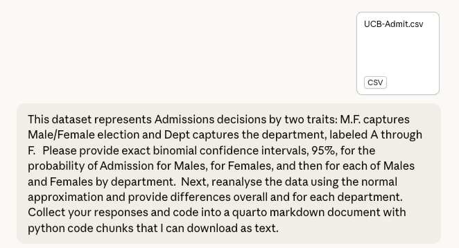

```{r setup, include=FALSE}
library(reticulate)
```



::: {.callout-note appearance="simple"}
## Prompt

This dataset represents Admissions decisions by two traits: M.F. captures Male/Female election and Dept captures the department, labeled A through F. Please provide exact binomial confidence intervals, 95%, for the probability of Admission for Males, for Females, and then for each of Males and Females by department. Next, reanalyse the data using the normal approximation and provide differences overall and for each department. Collect your responses and code into a quarto markdown document with python code chunks that I can download as text.

:::


## Overview

This document analyses the UC Berkeley admissions dataset. Each row represents one
applicant with columns `M.F` (Male/Female), `Admit` (Yes/No), and `Dept` (A–F).
We compute:

1. Exact (Clopper–Pearson) 95% binomial confidence intervals for the probability
   of admission for Males overall, Females overall, and each gender × department cell.
2. Normal-approximation (Wald) 95% CIs for the same quantities, and the
   Male − Female difference in admission probability, overall and by department.

---

## Setup

```{python}
import pandas as pd
import numpy as np
from scipy.stats import norm, beta as beta_dist

# ── load data ────────────────────────────────────────────────────────────────
df = pd.read_csv("./data/UCB-Admit.csv")
df.columns = df.columns.str.strip()          # remove BOM / whitespace
df["admitted"] = (df["Admit"] == "Yes").astype(int)

print(df.shape)
print(df.head())
print(df["M.F"].value_counts())
print(df["Dept"].value_counts().sort_index())
```

---

## Part 1 — Exact (Clopper–Pearson) Binomial CIs

The exact 95% CI for a binomial proportion with $k$ successes out of $n$ trials is

$$
\left[\, B\!\left(\tfrac{\alpha}{2};\, k,\, n-k+1\right),\;
        B\!\left(1-\tfrac{\alpha}{2};\, k+1,\, n-k\right) \right]
$$

where $B(p; a, b)$ is the $p$-th quantile of a Beta distribution.  
`scipy.stats.binom.proportion_confint` (method `'exact'`) implements this directly.

```{python}
from scipy.stats import beta as beta_dist

def exact_ci(k, n, alpha=0.05):
    """Clopper-Pearson exact 95% CI via the Beta distribution."""
    lo = beta_dist.ppf(alpha / 2,     k,     n - k + 1) if k > 0 else 0.0
    hi = beta_dist.ppf(1 - alpha / 2, k + 1, n - k)     if k < n else 1.0
    return k / n, lo, hi

def summarise(sub):
    n   = len(sub)
    k   = sub["admitted"].sum()
    p, lo, hi = exact_ci(k, n)
    return pd.Series({"n": n, "admits": k, "p_hat": p,
                      "CI_low": lo, "CI_high": hi})
```

### 1a. Overall by gender

```{python}
overall_exact = (
    df.groupby("M.F")
      .apply(summarise)
      .reset_index()
)
overall_exact.columns = ["Gender", "n", "Admits", "p_hat", "CI_low", "CI_high"]

# Format for display
disp = overall_exact.copy()
for c in ["p_hat", "CI_low", "CI_high"]:
    disp[c] = disp[c].map("{:.4f}".format)
print(disp.to_string(index=False))
```

### 1b. By gender × department

```{python}
dept_exact = (
    df.groupby(["M.F", "Dept"])
      .apply(summarise)
      .reset_index()
)
dept_exact.columns = ["Gender", "Dept", "n", "Admits", "p_hat", "CI_low", "CI_high"]

disp2 = dept_exact.copy()
for c in ["p_hat", "CI_low", "CI_high"]:
    disp2[c] = disp2[c].map("{:.4f}".format)
print(disp2.to_string(index=False))
```

---

## Part 2 — Normal (Wald) Approximation CIs and Differences

The Wald CI for a proportion is

$$\hat{p} \pm z_{\alpha/2}\sqrt{\frac{\hat{p}(1-\hat{p})}{n}}$$

For the **difference** $\delta = \hat{p}_M - \hat{p}_F$ the standard error is

$$\text{SE}_\delta = \sqrt{\frac{\hat{p}_M(1-\hat{p}_M)}{n_M} + \frac{\hat{p}_F(1-\hat{p}_F)}{n_F}}$$

```{python}
z = norm.ppf(0.975)   # ≈ 1.96

def wald_ci(k, n):
    p = k / n
    se = np.sqrt(p * (1 - p) / n)
    return p, p - z * se, p + z * se

def diff_wald(km, nm, kf, nf):
    pm, lom, him = wald_ci(km, nm)
    pf, lof, hif = wald_ci(kf, nf)
    delta = pm - pf
    se_d  = np.sqrt(pm*(1-pm)/nm + pf*(1-pf)/nf)
    return delta, delta - z*se_d, delta + z*se_d
```

### 2a. Overall Wald CIs

```{python}
def wald_summarise(sub):
    n = len(sub)
    k = sub["admitted"].sum()
    p, lo, hi = wald_ci(k, n)
    return pd.Series({"n": n, "admits": k,
                      "p_hat": p, "Wald_low": lo, "Wald_high": hi})

overall_wald = (
    df.groupby("M.F")
      .apply(wald_summarise)
      .reset_index()
)
overall_wald.columns = ["Gender", "n", "Admits", "p_hat", "Wald_low", "Wald_high"]

disp3 = overall_wald.copy()
for c in ["p_hat", "Wald_low", "Wald_high"]:
    disp3[c] = disp3[c].map("{:.4f}".format)
print(disp3.to_string(index=False))
```

### 2b. Department-level Wald CIs

```{python}
dept_wald = (
    df.groupby(["M.F", "Dept"])
      .apply(wald_summarise)
      .reset_index()
)
dept_wald.columns = ["Gender", "Dept", "n", "Admits", "p_hat", "Wald_low", "Wald_high"]

disp4 = dept_wald.copy()
for c in ["p_hat", "Wald_low", "Wald_high"]:
    disp4[c] = disp4[c].map("{:.4f}".format)
print(disp4.to_string(index=False))
```

### 2c. Male − Female differences (overall and by department)

```{python}
def make_diff_table(wald_df):
    male   = wald_df[wald_df["Gender"] == "Male"].copy()
    female = wald_df[wald_df["Gender"] == "Female"].copy()

    grp_col = [c for c in wald_df.columns if c not in
               ("Gender", "n", "Admits", "p_hat", "Wald_low", "Wald_high")]

    rows = []
    if grp_col:
        keys = male[grp_col[0]].unique()
        for k in sorted(keys):
            rm = male  [male  [grp_col[0]] == k].iloc[0]
            rf = female[female[grp_col[0]] == k].iloc[0]
            delta, dlo, dhi = diff_wald(rm["Admits"], rm["n"],
                                        rf["Admits"], rf["n"])
            rows.append({grp_col[0]: k,
                         "p_Male": rm["p_hat"], "p_Female": rf["p_hat"],
                         "Diff (M-F)": delta,
                         "Diff_CI_low": dlo, "Diff_CI_high": dhi})
    else:
        rm = male.iloc[0]; rf = female.iloc[0]
        delta, dlo, dhi = diff_wald(rm["Admits"], rm["n"],
                                    rf["Admits"], rf["n"])
        rows.append({"p_Male": rm["p_hat"], "p_Female": rf["p_hat"],
                     "Diff (M-F)": delta,
                     "Diff_CI_low": dlo, "Diff_CI_high": dhi})

    return pd.DataFrame(rows)

# Overall difference
overall_diff = make_diff_table(overall_wald)
disp5 = overall_diff.copy()
for c in ["p_Male", "p_Female", "Diff (M-F)", "Diff_CI_low", "Diff_CI_high"]:
    disp5[c] = disp5[c].map("{:.4f}".format)
print("=== Overall Male − Female difference ===")
print(disp5.to_string(index=False))

# Department-level differences
dept_diff = make_diff_table(dept_wald)
disp6 = dept_diff.copy()
for c in ["p_Male", "p_Female", "Diff (M-F)", "Diff_CI_low", "Diff_CI_high"]:
    disp6[c] = disp6[c].map("{:.4f}".format)
print("\n=== Department-level Male − Female differences ===")
print(disp6.to_string(index=False))
```

---

## Part 3 — Side-by-side comparison: Exact vs. Wald

```{python}
# Merge exact and wald for overall
cmp_overall = overall_exact.merge(
    overall_wald[["Gender", "Wald_low", "Wald_high"]],
    on="Gender"
)
print("=== Overall: Exact vs Wald CI bounds ===")
disp7 = cmp_overall.copy()
for c in ["p_hat", "CI_low", "CI_high", "Wald_low", "Wald_high"]:
    disp7[c] = disp7[c].map("{:.4f}".format)
print(disp7.to_string(index=False))

# By department
cmp_dept = dept_exact.merge(
    dept_wald[["Gender", "Dept", "Wald_low", "Wald_high"]],
    on=["Gender", "Dept"]
)
print("\n=== By Department: Exact vs Wald CI bounds ===")
disp8 = cmp_dept.copy()
for c in ["p_hat", "CI_low", "CI_high", "Wald_low", "Wald_high"]:
    disp8[c] = disp8[c].map("{:.4f}".format)
print(disp8.to_string(index=False))
```

---

## Discussion

### Simpson's Paradox

The aggregate data (Part 1a / 2a) suggest Males are admitted at a **higher** rate
than Females overall.  However, when we examine each department separately
(Parts 1b / 2b / 2c), the Male − Female difference is **small and often negative**
(females admitted at equal or higher rates within most departments).

This reversal is a classic demonstration of **Simpson's Paradox**: females
disproportionately applied to departments with low overall admission rates
(C–F), dragging down the female aggregate even though they fared similarly or
better within each department.

### Exact vs. Normal approximation

At the large sample sizes present here the Wald and Clopper–Pearson intervals
agree closely overall.  Some department-level cells (especially small female
counts in Dept A) show modest discrepancies, which is expected: the Wald
approximation degrades when $n$ is small or $\hat p$ is close to 0 or 1.
The exact interval is preferred in those situations.
