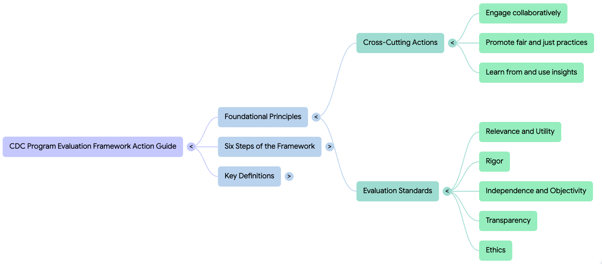
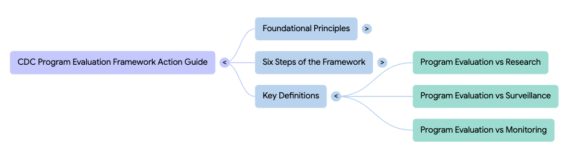

# tldr;

The combination of a mind map and a blog post from NotebookLM take us some way to understanding the CDC Program Evaluation Framework.

.png)

::: {.callout-note appearance="simple"}
## Prompt

create a blog post on the CDC Program Evaluation Framework .pdf
:::

# Beyond the Checklist: 5 Surprising Lessons from the CDC on How to Truly Measure Success

Many public health initiatives today are trapped in a "crisis of utility." Organizations invest heavily in collecting mountains of data, yet they often find themselves with information that is technically accurate but strategically hollow. When metrics become a mere compliance exercise, we lose the ability to drive the very change we set out to achieve.

The CDC Program Evaluation Framework Action Guide provides a much-needed corrective to this frustration. Far from being a dry technical manual, it serves as a sophisticated roadmap for transforming public health actions into high-performing systems. By prioritizing insight over information, the guide demands a fundamental shift in how we define and measure professional success.

## Takeaway 1: Evaluation is Not Research (And Why That Matters)

In professional circles, we often conflate "evaluation" with "research," assuming that any scientific inquiry follows the same rules. However, the CDC argues that their goals are fundamentally different, and confusing the two can stall a program’s progress. While research seeks to expand universal knowledge, evaluation is a localized feedback loop designed for immediate real-world action.

This distinction is critical for decision-makers because it shifts the focus from proving a theory to improving a specific operation. Evaluation is a tool for determining value and significance within a unique environment, providing the agility needed to refine activities in real-time. This focus on "utility" ensures that data collection serves the program’s evolution rather than an abstract academic interest.

Research seeks to contribute to generalizable knowledge and test a hypothesis, whereas evaluation seeks to continuously improve programs and produce findings and recommendations for decision-making.

## Takeaway 2: If You Ignore Context, You’re Inviting Bias

A senior strategist knows that context is not just a backdrop; it is the terrain upon which a program succeeds or fails. Before a single data point is gathered, the CDC framework requires a rigorous "Evaluability Assessment" to determine if a program is even ready to be measured. If the program logic is unclear or data is inaccessible, measuring success is an exercise in futility.

Truly assessing context requires distinguishing between internal "Programmatic Features," such as funding history and leadership commitment, and the external "Programmatic Environment," which includes social, economic, and political factors. Ignoring these place-based dimensions can lead to data that is technically correct but practically useless because it fails to represent the lived experience of the community. Failure to account for context often results in:

* Misaligned Priorities: The wrong interest holders are engaged, leading to a fundamental misunderstanding of what success looks like.
* Systemic Bias: The evaluation inadvertently reflects the culture and values of the evaluation team rather than the participants served.
* Inaccessible Reporting: Findings are presented in modes only accessible to dominant cultures or those in positions of power, limiting the ability of impacted groups to achieve optimal health.
* Unintentional Harm: Program participants are engaged in ways that are not respectful, increasing distrust and community harm.

## Takeaway 3: Interest Holders are "Co-Owners," Not Just Audience Members

Effective evaluation requires moving beyond the "survey and report" model to a state of collaborative "co-ownership." The CDC identifies four critical types of interest holders: those served, those implementing the program, those using the findings, and—perhaps most importantly—those who are skeptical. Engaging skeptics early is a strategic move to neutralize resistance and ensure the evaluation addresses concerns regarding attribution and cost-benefit.

This collaboration must happen during the design phase, not just at the end when results are released. By involving these diverse groups in shaping the evaluation questions, the evaluator increases the perceived validity of the findings. This shared ownership transforms interest holders from passive observers into active partners who are far more likely to champion and apply the resulting insights.

## Takeaway 4: The Evaluator is the "Instrument" (The Power of Reflective Practice)

In high-stakes public health work, the evaluator is not a neutral observer but a sensitive "instrument" through which all data is filtered. An evaluator’s personal lens—shaped by their own beliefs, values, and experiences—directly influences which questions are asked and which voices are prioritized. Consequently, "calibration" through reflective practice is not a personal choice but a professional requirement for cultural humility.

By adopting a "listening and learning" mindset, evaluators can identify how their own value systems might unintentionally favor certain perspectives or overlook critical community needs. This reflective process allows the evaluator to adjust their practices to create a more equitable space for participation. It ensures that the final evaluation is a true reflection of the program's impact rather than a mirror of the evaluator's biases.

The process of reflective practice is meant to empower the evaluator to adopt a listening and learning mindset by reflecting on their own belief systems, identifying how those belief systems could emerge during the evaluation, and taking proactive steps to practice mutual respect for interest holders.

## Takeaway 5: The "Iteration" Secret -- It’s Not a Linear Path

While many view evaluation as the final step in a project, the CDC Action Guide reveals it as an iterative engine for the "Performance Improvement Framework." The framework consists of a continuous cycle: Plan, Implement, Measure & Monitor, and finally, Evaluate & Act. Success is not found in "finishing a report," but in how effectively that report restarts the cycle.

*Step 6, "Act on Findings," serves as the vital bridge back to the "Plan" phase of the next cycle.* This iterative loop ensures that evaluation is never a dead-end; instead, it provides the evidence-based fuel for programmatic refinement and strategic decision-making. By embracing this non-linear path, organizations move from checking a box to building a performance engine that achieves better outcomes over time.

## Conclusion: Moving Toward Actionable Insights

The CDC Program Evaluation Framework Action Guide demands that we stop treating data collection as a passive exercise and start seeing it as a strategic intervention. By distinguishing evaluation from research, prioritizing evaluability, and treating skeptics as co-owners, we can generate the insights necessary to drive real-world change.

As you look at your current portfolio, challenge yourself to look past the spreadsheets and ask: How would a formal "reflective practice" or a deeper assessment of "place-based context" change the way you define success for your most important project?
