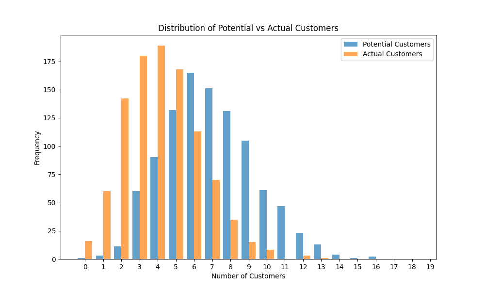
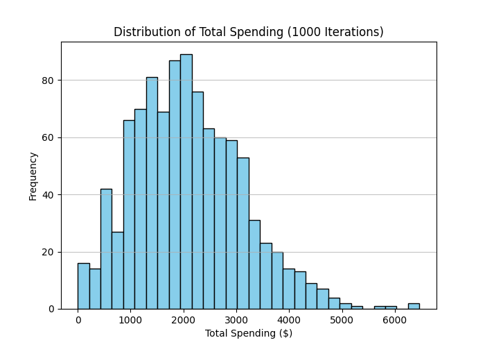
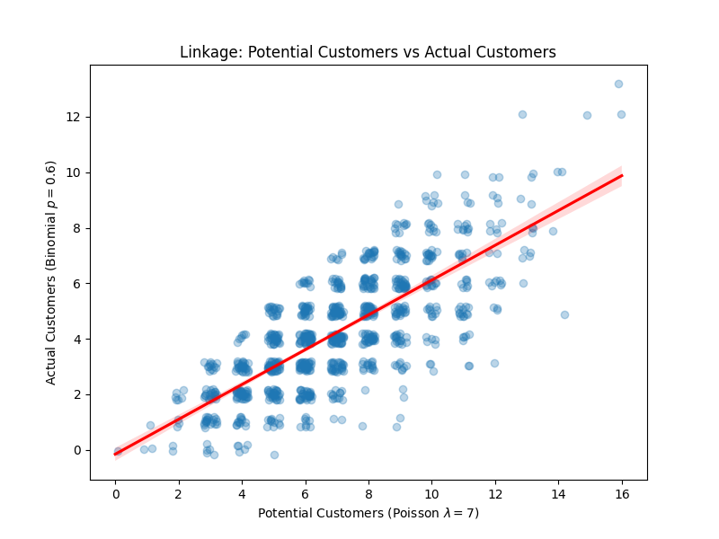
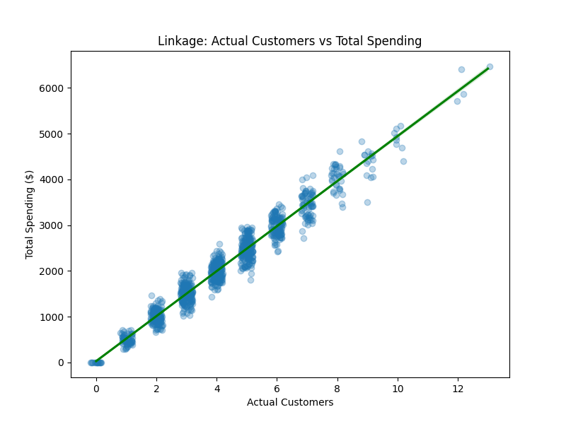

# Monte Carlo Business Case

](./Screenshot 2026-02-17 at 8.58.56 AM.png)

Gemini is a powerful tool for Monte Carlo simulation.

```{r setup, include=FALSE}
library(reticulate)
```


::: {.callout-note appearance="simple"}

## Prompt: 

Can you generate a Monte Carlo simulation of Potential.Customers, distributed Poisson with arrival rate 7, Customers making a purchase with probability 0.6 from the set of Potential.Customers, and each Customer spending normal with mean 500 dollars and standard deviation of 100 dollars.  Try 1000 iterations.
:::


```{python}
import numpy as np
import pandas as pd
import matplotlib.pyplot as plt

# Set seed for reproducibility
np.random.seed(42)

# Parameters
iterations = 1000
lambda_poisson = 7
p_purchase = 0.6
mean_spending = 500
std_spending = 100

results = []

for i in range(iterations):
    # Step 1: Sample Potential Customers
    potential_customers = np.random.poisson(lambda_poisson)
    
    # Step 2: Sample Actual Customers (Binomial)
    # Alternatively: check each potential customer with a 0.6 prob
    actual_customers = np.random.binomial(n=potential_customers, p=p_purchase)
    
    # Step 3: Sample Spending for each customer
    if actual_customers > 0:
        individual_spendings = np.random.normal(mean_spending, std_spending, actual_customers)
        total_spending = np.sum(individual_spendings)
    else:
        total_spending = 0.0
        
    results.append({
        'Iteration': i + 1,
        'Potential_Customers': potential_customers,
        'Actual_Customers': actual_customers,
        'Total_Spending': total_spending
    })

df = pd.DataFrame(results)

# Save to CSV
df.to_csv('monte_carlo_simulation_results.csv', index=False)

# Summary statistics
summary_stats = df.describe()
print(summary_stats)

# Plotting the distribution of Total Spending
plt.hist(df['Total_Spending'], bins=30, color='skyblue', edgecolor='black')
plt.title('Distribution of Total Spending (1000 Iterations)')
plt.xlabel('Total Spending ($)')
plt.ylabel('Frequency')
plt.grid(axis='y', alpha=0.75)
plt.savefig('total_spending_distribution.png')

# Plotting Potential vs Actual Customers
plt.clf()
plt.figure(figsize=(10, 6))
plt.hist([df['Potential_Customers'], df['Actual_Customers']], label=['Potential Customers', 'Actual Customers'], bins=np.arange(0, 20) - 0.5, alpha=0.7)
plt.title('Distribution of Potential vs Actual Customers')
plt.xlabel('Number of Customers')
plt.ylabel('Frequency')
plt.legend()
plt.xticks(range(0, 20))
plt.savefig('customer_counts.png')
```





```{r}
my.df <- read.csv("monte_carlo_simulation_results.csv")
library(DT)
DT::datatable(my.df)
```

```{python}
import numpy as np
import pandas as pd
import matplotlib.pyplot as plt
import seaborn as sns

# 1. Visualization of Linkage: Potential vs Actual
plt.figure(figsize=(8, 6))
# Adding jitter to show density better
sns.regplot(data=df, x='Potential_Customers', y='Actual_Customers', x_jitter=0.2, y_jitter=0.2, 
            scatter_kws={'alpha':0.3}, line_kws={'color':'red'})
plt.title('Linkage: Potential Customers vs Actual Customers')
plt.xlabel('Potential Customers (Poisson $\\lambda=7$)')
plt.ylabel('Actual Customers (Binomial $p=0.6$)')
plt.savefig('linkage_potential_vs_actual.png')

# 2. Visualization of Linkage: Actual Customers vs Total Spending
plt.clf()
plt.figure(figsize=(8, 6))
sns.regplot(data=df, x='Actual_Customers', y='Total_Spending', x_jitter=0.2, 
            scatter_kws={'alpha':0.3}, line_kws={'color':'green'})
plt.title('Linkage: Actual Customers vs Total Spending')
plt.xlabel('Actual Customers')
plt.ylabel('Total Spending ($)')
plt.savefig('linkage_actual_vs_spending.png')


# Correlations
correlations = df[['Potential_Customers', 'Actual_Customers', 'Total_Spending']].corr()
print("Correlation Matrix:")
print(correlations)
```






```text
Correlation Matrix:
                     Potential_Customers  Actual_Customers  Total_Spending
Potential_Customers             1.000000          0.758090        0.742648
Actual_Customers                0.758090          1.000000        0.979867
Total_Spending                  0.742648          0.979867        1.000000
```


I have refined the Monte Carlo simulation to explicitly demonstrate and visualize how the variables are interlinked.

### Implementation Logic

* **Step 1 (Arrival):** A random number of **Potential Customers** is drawn from a Poisson distribution ().
* **Step 2 (Conversion):** The number of **Actual Customers** is then drawn from a Binomial distribution where the number of trials () is specifically the result from Step 1, and the success probability is .
* **Step 3 (Spending):** For *every* actual customer identified in Step 2, a unique spending amount is drawn from a Normal distribution (). The **Total Spending** is the sum of these individual draws.


### Visualizing the Linkages

1. **Potential vs. Actual Customers**: The first plot shows a direct linear relationship. Because the Binomial "n" is the Potential Customer count, you can see that the number of actual customers is constrained by the number of arrivals.
2. **Actual Customers vs. Total Spending**: This shows an extremely strong linear link. Since each additional customer adds an average of  to the total, the volume of customers is the strongest predictor of total revenue.
3. **Individual Customer Spending**: To confirm that each customer is an individual draw, the third plot shows the distribution of every single purchase across all iterations. It forms a perfect normal bell curve centered at .
