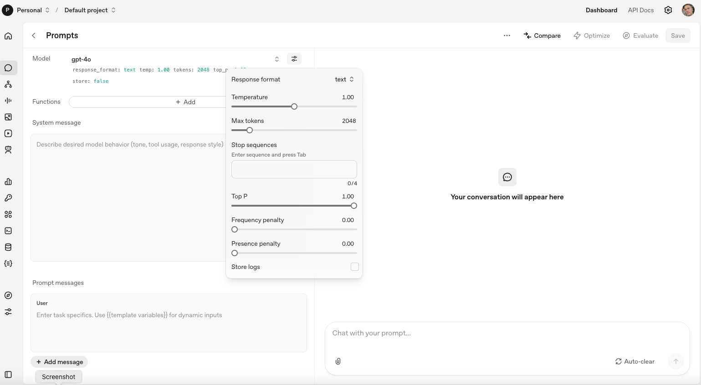

# Overview

Digging in to large language models has reached a fork.  For the most part, local and older models can be subjects of experimentation while users are limited in the deployment of frontier models.  Outsourcing these choices to company developers is unsatisfactory for at least some deployments so it is useful to explore the architecture of models generally.

I am going to make use of the playground from OpenAI.  With older models, it is still possible to expose the key hypoerparameters that are fixed in other settings.

The menu exposes the key hyperparameters that we can manipulate with this model.

- A system message.  
- The (usual) prompt message.  
- Temperature.  
- Maximum response tokens.  
- Top p tokens for selection.  
- Frequency and presence penalties.

As we get to newer models, the nature of hyperparameters changes.  For example, gpt-5.2 allows a user to interact with the reasoning effort only.